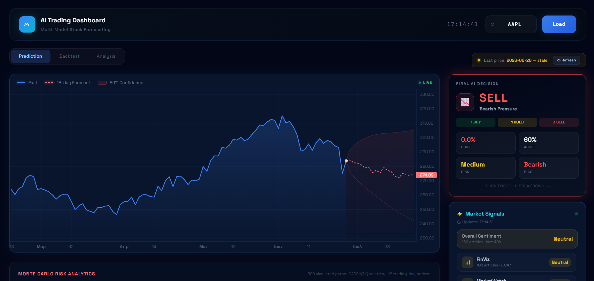

# Κεφάλαιο 1 — Εισαγωγή στο σύστημα και στο ερευνητικό πλαίσιο

## 1.1 Εισαγωγή

Οι χρηματιστηριακές αγορές αποτελούν έναν από τους πιο σύνθετους και δυναμικούς θεσμούς της σύγχρονης οικονομίας. Σε αυτές διαπραγματεύονται καθημερινά τίτλοι αξίας δισεκατομμυρίων, ενώ οι τιμές των μετοχών μεταβάλλονται διαρκώς, αντανακλώντας τις προσδοκίες εκατομμυρίων συμμετεχόντων. Η κατανόηση και, κατά το δυνατόν, η πρόβλεψη της συμπεριφοράς αυτών των αγορών αποτελεί διαχρονικά αντικείμενο έντονου ενδιαφέροντος, τόσο για την ακαδημαϊκή κοινότητα όσο και για τους επαγγελματίες του χρηματοοικονομικού κλάδου.

Τις τελευταίες δεκαετίες, η τεχνολογική πρόοδος έχει μεταμορφώσει ριζικά τον τρόπο με τον οποίο προσεγγίζεται το πρόβλημα αυτό. Η ψηφιοποίηση των αγορών, η διαθεσιμότητα τεράστιου όγκου δεδομένων σε πραγματικό χρόνο και η εκρηκτική ανάπτυξη της υπολογιστικής ισχύος έχουν δημιουργήσει νέες δυνατότητες ανάλυσης. Παράλληλα, η άνοδος της χρηματοοικονομικής τεχνολογίας (FinTech) και της τεχνητής νοημοσύνης έχει επιτρέψει την ανάπτυξη συστημάτων που αναλύουν αυτόματα δεδομένα, αναγνωρίζουν πρότυπα και υποστηρίζουν τη λήψη επενδυτικών αποφάσεων.

Ένα ιδιαίτερα σημαντικό χαρακτηριστικό της σύγχρονης εποχής είναι η εκθετική αύξηση της μη δομημένης πληροφορίας. Πέρα από τα κλασικά ποσοτικά δεδομένα — τιμές, όγκοι συναλλαγών, οικονομικοί δείκτες — καθημερινά παράγεται τεράστιος όγκος κειμενικού περιεχομένου που σχετίζεται με τις αγορές: ειδησεογραφικά άρθρα, ανακοινώσεις εταιρειών, οικονομικές αναλύσεις και, ολοένα και περισσότερο, αναρτήσεις σε κοινωνικά δίκτυα. Η πληροφορία αυτή επηρεάζει άμεσα τις προσδοκίες και τη συμπεριφορά των επενδυτών, και κατ' επέκταση τις τιμές των μετοχών. Ωστόσο, η αξιοποίησή της απαιτεί προηγμένες τεχνικές επεξεργασίας φυσικής γλώσσας, ικανές να εξάγουν νόημα και συναίσθημα από τεράστιους όγκους κειμένου.

Η παρούσα διπλωματική εργασία τοποθετείται ακριβώς στη συμβολή αυτών των τάσεων. Αντικείμενό της είναι η ανάπτυξη ενός έξυπνου, event-driven συστήματος πρόβλεψης χρηματιστηριακών κινήσεων, το οποίο συνδυάζει την αυτοματοποιημένη συλλογή δεδομένων από πολλαπλές και ετερογενείς πηγές, την ανάλυση συναισθήματος μέσω σύγχρονων γλωσσικών μοντέλων, τη συνδυαστική χρήση αλγορίθμων μηχανικής μάθησης και τη διαδραστική οπτικοποίηση των αποτελεσμάτων. Στόχος του συστήματος είναι η παραγωγή σαφών προτάσεων αγοραπωλησίας — «Αγορά», «Πώληση» ή «Κράτηση» — υποστηρίζοντας τον χρήστη στη λήψη αποφάσεων. Ένα θεμελιώδες χαρακτηριστικό του εγχειρήματος είναι η αποκλειστική χρήση τεχνολογιών ανοιχτού κώδικα, η οποία αναδεικνύει τη δυνατότητα δημιουργίας ενός λειτουργικού και διαφανούς συστήματος χωρίς εξάρτηση από δαπανηρές εμπορικές πλατφόρμες.

## 1.2 Το πρόβλημα της πρόβλεψης χρηματιστηριακών κινήσεων

Η πρόβλεψη της μελλοντικής πορείας των τιμών των μετοχών αποτελεί ένα από τα πλέον δύσκολα και αμφιλεγόμενα προβλήματα της χρηματοοικονομικής επιστήμης. Στον πυρήνα της συζήτησης βρίσκεται η **υπόθεση της αποτελεσματικής αγοράς** (Efficient Market Hypothesis, EMH), η οποία διατυπώθηκε από τον Fama (1970). Σύμφωνα με την υπόθεση αυτή, οι τιμές των τίτλων ενσωματώνουν άμεσα και πλήρως κάθε διαθέσιμη πληροφορία. Αν αυτό ισχύει, τότε καμία ανάλυση —ούτε των ιστορικών τιμών ούτε των δημόσιων πληροφοριών— δεν μπορεί να αποφέρει συστηματικά υπερβάλλουσες αποδόσεις, καθώς οποιαδήποτε νέα πληροφορία αντικατοπτρίζεται στιγμιαία στις τιμές.

Στενά συνδεδεμένη με την EMH είναι η **θεωρία του τυχαίου περιπάτου** (random walk), σύμφωνα με την οποία οι μεταβολές των τιμών είναι ουσιαστικά απρόβλεπτες και ακολουθούν μια στοχαστική διαδικασία (Malkiel, 2003). Υπό αυτό το πρίσμα, η βραχυπρόθεσμη πρόβλεψη θα ήταν θεωρητικά αδύνατη.

Ωστόσο, η αυστηρή εκδοχή της υπόθεσης αυτής έχει αμφισβητηθεί έντονα. Ο κλάδος της **συμπεριφορικής χρηματοοικονομικής** (behavioral finance) έχει αναδείξει ότι οι επενδυτές δεν είναι πάντοτε ορθολογικοί, αλλά επηρεάζονται από γνωστικές προκαταλήψεις και συναισθηματικούς παράγοντες (Kahneman & Tversky, 1979). Ο Shiller (2003) υποστήριξε ότι οι αγορές παρουσιάζουν φαινόμενα υπερβολικής μεταβλητότητας και «φούσκες», τα οποία δεν εξηγούνται από την καθαρά ορθολογική θεώρηση. Αυτές οι αποκλίσεις από την τέλεια αποτελεσματικότητα αφήνουν περιθώριο για την ύπαρξη —έστω και μικρών— προβλέψιμων προτύπων στις αγορές.

Η σύγχρονη έρευνα, αξιοποιώντας τεχνικές μηχανικής μάθησης, έχει δείξει ότι είναι εφικτή η επίτευξη ακρίβειας ελαφρώς υψηλότερης από το τυχαίο επίπεδο στη βραχυπρόθεσμη πρόβλεψη της κατεύθυνσης των τιμών (Jiang, 2021). Παρότι η ακρίβεια αυτή παραμένει περιορισμένη — γεγονός αναμενόμενο δεδομένης της εγγενούς δυσκολίας του προβλήματος — μπορεί, υπό προϋποθέσεις, να αποδειχθεί χρήσιμη. Είναι, επομένως, κρίσιμο κάθε τέτοιο σύστημα να αξιολογείται με αυστηρή μεθοδολογία, ώστε τα αποτελέσματα να μην είναι προϊόν υπερπροσαρμογής ή διαρροής πληροφορίας, αλλά να αντανακλούν την πραγματική προγνωστική του ικανότητα.

## 1.3 Ο ρόλος της πληροφορίας και του συναισθήματος στις αγορές

Ένας από τους σημαντικότερους παράγοντες που επηρεάζουν τις χρηματιστηριακές τιμές είναι η ροή της πληροφορίας. Νέα γεγονότα — οικονομικές ανακοινώσεις, εταιρικά αποτελέσματα, γεωπολιτικές εξελίξεις — μεταβάλλουν τις προσδοκίες των επενδυτών και προκαλούν αντίστοιχες κινήσεις στις τιμές. Καθοριστικό ρόλο, ωστόσο, δεν παίζει μόνο το ίδιο το γεγονός, αλλά και ο **τρόπος** με τον οποίο αυτό παρουσιάζεται και γίνεται αντιληπτό.

Η ερευνητική βιβλιογραφία έχει τεκμηριώσει εκτενώς τη σύνδεση μεταξύ του συναισθήματος που εκφράζεται στα μέσα και της μετέπειτα συμπεριφοράς των αγορών. Ο Tetlock (2007), σε μια θεμελιώδη μελέτη, έδειξε ότι ο τόνος (θετικός ή αρνητικός) των οικονομικών στηλών του Τύπου συσχετίζεται με τις κινήσεις της αγοράς. Αντίστοιχα, οι Bollen, Mao και Zeng (2011) κατέδειξαν ότι η συναισθηματική διάθεση που αποτυπώνεται σε αναρτήσεις του Twitter μπορεί να προβλέψει, σε κάποιον βαθμό, τις μεταβολές βιομηχανικών δεικτών. Οι μελέτες αυτές υπογραμμίζουν ότι το συλλογικό συναίσθημα αποτελεί μια αξιοποιήσιμη πηγή προγνωστικής πληροφορίας.

Η εξαγωγή του συναισθήματος από κείμενο εντάσσεται στο πεδίο της **ανάλυσης συναισθήματος** (sentiment analysis), έναν κλάδο της επεξεργασίας φυσικής γλώσσας. Στον χρηματοοικονομικό τομέα, η ανάλυση αυτή παρουσιάζει ιδιαίτερες προκλήσεις, καθώς η ορολογία είναι εξειδικευμένη και το νόημα συχνά εξαρτάται από τα συμφραζόμενα. Για τον λόγο αυτό, αναπτύχθηκαν εξειδικευμένα εργαλεία, όπως τα λεξικά οικονομικών όρων (Loughran & McDonald, 2011) και, πιο πρόσφατα, εξειδικευμένα γλωσσικά μοντέλα όπως το FinBERT (Araci, 2019), τα οποία επιτυγχάνουν σημαντικά υψηλότερη ακρίβεια στην κατανόηση του χρηματοοικονομικού κειμένου.

Παράλληλα, η αξιοπιστία της πηγής της πληροφορίας αποτελεί κρίσιμη παράμετρο. Μια είδηση από έναν θεσμικό ειδησεογραφικό οργανισμό δεν φέρει το ίδιο βάρος με μια ανώνυμη ανάρτηση σε ένα κοινωνικό δίκτυο. Η ενσωμάτωση της διάστασης της αξιοπιστίας στην ανάλυση του συναισθήματος, όπως επιχειρείται στην παρούσα εργασία, αποτελεί ένα στοιχείο που συχνά παραβλέπεται από τις υπάρχουσες προσεγγίσεις.

## 1.4 Υπάρχουσες προσεγγίσεις πρόβλεψης

Στη διάρκεια των ετών έχει αναπτυχθεί ένα ευρύ φάσμα προσεγγίσεων για την ανάλυση και πρόβλεψη των αγορών, οι οποίες μπορούν να ταξινομηθούν σε διακριτές κατηγορίες.

### 1.4.1 Παραδοσιακή ανάλυση: θεμελιώδης και τεχνική

Η **θεμελιώδης ανάλυση** (fundamental analysis) επιχειρεί να εκτιμήσει την «πραγματική» αξία μιας μετοχής μελετώντας τα οικονομικά μεγέθη της εταιρείας (κέρδη, έσοδα, χρέος) και το ευρύτερο μακροοικονομικό περιβάλλον. Η προσέγγιση αυτή είναι κυρίως μακροπρόθεσμη και απαιτεί εκτενή ανθρώπινη κρίση.

Η **τεχνική ανάλυση** (technical analysis), από την άλλη, μελετά αποκλειστικά τα ιστορικά δεδομένα τιμών και όγκου, αναζητώντας επαναλαμβανόμενα μοτίβα μέσω δεικτών όπως οι κινητοί μέσοι όροι, ο δείκτης σχετικής ισχύος (RSI) και ο δείκτης σύγκλισης-απόκλισης κινητών μέσων (MACD). Αν και ευρέως διαδεδομένη, η τεχνική ανάλυση επικρίνεται για την υποκειμενικότητά της και δυσκολεύεται να ενσωματώσει τη μη δομημένη πληροφορία των ειδήσεων.

### 1.4.2 Εμπορικές πλατφόρμες και robo-advisors

Στον επαγγελματικό χώρο κυριαρχούν εξειδικευμένες εμπορικές πλατφόρμες, όπως τα τερματικά Bloomberg και Reuters Eikon, οι οποίες προσφέρουν ολοκληρωμένες υπηρεσίες δεδομένων και ανάλυσης. Παρά τις δυνατότητές τους, οι πλατφόρμες αυτές χαρακτηρίζονται από εξαιρετικά υψηλό κόστος και κλειστή αρχιτεκτονική, που περιορίζει τη διαφάνεια και την προσαρμοστικότητα. Οι **αυτοματοποιημένοι σύμβουλοι επενδύσεων** (robo-advisors) προσφέρουν προσιτότερες, αυτοματοποιημένες υπηρεσίες, αλλά συνήθως επικεντρώνονται στη μακροπρόθεσμη διαχείριση χαρτοφυλακίου παρά στη βραχυπρόθεσμη πρόβλεψη.

### 1.4.3 Προσεγγίσεις μηχανικής και βαθιάς μάθησης

Η ραγδαία ανάπτυξη της μηχανικής μάθησης έχει οδηγήσει σε μια πλούσια ερευνητική παραγωγή. Αλγόριθμοι όπως τα δάση τυχαίων δέντρων και οι μέθοδοι ενισχυμένης κλιμάκωσης (gradient boosting) έχουν εφαρμοστεί σε δομημένα χρηματιστηριακά δεδομένα με ενθαρρυντικά αποτελέσματα. Στον τομέα της βαθιάς μάθησης, τα αναδρομικά νευρωνικά δίκτυα και ειδικότερα τα δίκτυα μακράς-βραχείας μνήμης (LSTM) έχουν αποδειχθεί ιδιαίτερα κατάλληλα για την ανάλυση χρονοσειρών, καθώς αναγνωρίζουν χρονικές εξαρτήσεις στις ακολουθίες των τιμών (Fischer & Krauss, 2018). Σημαντική είναι, επίσης, η εργασία των Ding et al. (2015), οι οποίοι πρότειναν μια **event-driven** προσέγγιση βαθιάς μάθησης, αξιοποιώντας γεγονότα που εξάγονται από ειδήσεις για την πρόβλεψη των τιμών — μια κατεύθυνση συγγενή με αυτήν της παρούσας εργασίας.

### 1.4.4 Προσεγγίσεις βασισμένες στο συναίσθημα

Μια ξεχωριστή κατηγορία αφορά τις προσεγγίσεις που αξιοποιούν το συναίσθημα από ειδήσεις και κοινωνικά δίκτυα ως προγνωστικό σήμα (Nguyen et al., 2015). Οι προσεγγίσεις αυτές έχουν δείξει ότι η ενσωμάτωση της κειμενικής πληροφορίας μπορεί να βελτιώσει την ακρίβεια των προβλέψεων σε σχέση με τα μοντέλα που βασίζονται αποκλειστικά στις τιμές. Ωστόσο, οι περισσότερες περιορίζονται είτε σε μία μόνο πηγή είτε σε μία μόνο τεχνική, χωρίς να επιχειρούν την ολοκληρωμένη ενοποίηση πολλαπλών πηγών, την αξιολόγηση της αξιοπιστίας τους και τον συνδυασμό με πολλαπλά μοντέλα.

## 1.5 Στόχοι της διπλωματικής εργασίας

Με βάση τα κενά που εντοπίζονται στις υπάρχουσες προσεγγίσεις, η παρούσα εργασία θέτει ως κεντρικό στόχο τη σχεδίαση και υλοποίηση ενός ολοκληρωμένου, αυτοματοποιημένου συστήματος πρόβλεψης χρηματιστηριακών κινήσεων. Οι επιμέρους στόχοι είναι οι εξής:

- **Ανάπτυξη event-driven μηχανισμού συλλογής δεδομένων** μέσω web scrapers, οι οποίοι παρακολουθούν και αντλούν πληροφορίες από πολλαπλές και ετερογενείς πηγές (χρηματιστηριακές πλατφόρμες, ειδησεογραφικές ιστοσελίδες και κοινωνικά δίκτυα), ενεργοποιούμενοι αυτόματα όταν εντοπίζονται νέα δεδομένα.

- **Εμπλουτισμός των δεδομένων με μεταδεδομένα** (προέλευση, χρονική επικαιρότητα, αξιοπιστία πηγής), τα οποία αξιοποιούνται για την εκτίμηση της ποιότητας της πληροφορίας.

- **Εκπαίδευση και προσαρμογή μοντέλων μηχανικής μάθησης ανοιχτού κώδικα** για τη βραχυπρόθεσμη πρόβλεψη, σε συνδυασμό με τεχνικές ανάλυσης συναισθήματος.

- **Σύγκριση και συνδυασμός των αποτελεσμάτων διαφορετικών μοντέλων** (ensemble learning) για τη βελτίωση της ακρίβειας και της αξιοπιστίας.

- **Οπτικοποίηση των αποτελεσμάτων** μέσω διαδραστικών γραφημάτων και σαφών ενδείξεων «Αγορά / Πώληση / Κράτηση».

Όλα τα παραπάνω επιδιώκονται με αποκλειστική χρήση τεχνολογιών ανοιχτού κώδικα, χωρίς εξάρτηση από εμπορικά εργαλεία.

## 1.6 Συμβολή της τεχνητής νοημοσύνης

Η τεχνητή νοημοσύνη διαπερνά όλα τα επίπεδα του συστήματος και η συμβολή της αναπτύσσεται σε τρεις βασικούς άξονες.

### 1.6.1 Ανάλυση συναισθήματος

Το σύστημα αξιοποιεί το προεκπαιδευμένο γλωσσικό μοντέλο FinBERT για την εκτίμηση του συναισθήματος του ειδησεογραφικού περιεχομένου. Η μη δομημένη κειμενική πληροφορία μετατρέπεται έτσι σε ποσοτικά χαρακτηριστικά, τα οποία σταθμίζονται με βάση την αξιοπιστία της πηγής και τροφοδοτούν τα προγνωστικά μοντέλα.

### 1.6.2 Συνδυαστική μάθηση

Αντί της εξάρτησης από ένα μεμονωμένο μοντέλο, το σύστημα συνδυάζει πέντε διαφορετικούς αλγορίθμους μηχανικής μάθησης. Η συνδυαστική αυτή προσέγγιση αξιοποιεί τα πλεονεκτήματα κάθε μοντέλου και περιορίζει τις επιμέρους αδυναμίες, οδηγώντας σε πιο εύρωστες προβλέψεις.

### 1.6.3 Πρόβλεψη τιμών και ανάλυση κινδύνου

Πέρα από την ταξινόμηση της κατεύθυνσης, νευρωνικά δίκτυα LSTM παράγουν μια προβολή της μελλοντικής πορείας της τιμής, η οποία συνοδεύεται από ανάλυση κινδύνου. Έτσι, ο χρήστης λαμβάνει μια ολοκληρωμένη εικόνα τόσο της αναμενόμενης τάσης όσο και της σχετικής αβεβαιότητας.

## 1.7 Ερευνητικό κενό και συνεισφορά της εργασίας

Από την ανασκόπηση της βιβλιογραφίας προκύπτει ότι, παρά την πληθώρα των επιμέρους προσεγγίσεων, ελάχιστες ενοποιούν σε ένα ενιαίο σύστημα όλα τα ακόλουθα στοιχεία: την αυτοματοποιημένη, event-driven συλλογή από πολλαπλές ετερογενείς πηγές, την αξιολόγηση της αξιοπιστίας τους, την ανάλυση συναισθήματος με εξειδικευμένα γλωσσικά μοντέλα, τη συνδυαστική πρόβλεψη μέσω πολλαπλών αλγορίθμων και τη διαφανή, ανοιχτού κώδικα υλοποίηση.

Η παρούσα εργασία επιχειρεί να καλύψει αυτό το κενό. Η συνεισφορά της είναι διττή. Σε τεχνικό επίπεδο, παρουσιάζει ένα ολοκληρωμένο, λειτουργικό σύστημα που ενσωματώνει όλα τα παραπάνω χαρακτηριστικά. Σε μεθοδολογικό επίπεδο, δίνει ιδιαίτερη έμφαση στην **έντιμη και αυστηρή αξιολόγηση**: μέσω χρονικού διαχωρισμού των δεδομένων αποφεύγεται η διαρροή πληροφορίας, ενώ μια ειδική μελέτη απομόνωσης τεκμηριώνει τη συγκεκριμένη συνεισφορά της ανάλυσης συναισθήματος. Έτσι, η εργασία δεν αποσκοπεί στην προβολή εντυπωσιακών αλλά παραπλανητικών ποσοστών, παρά στην παραγωγή ρεαλιστικών και επιστημονικά αξιόπιστων συμπερασμάτων.

## 1.8 Δομή της διπλωματικής εργασίας

Η εργασία οργανώνεται σε εννέα κεφάλαια. Στο **Κεφάλαιο 2** παρουσιάζεται το τεχνολογικό υπόβαθρο και τα εργαλεία ανάπτυξης, καθώς και οι βασικές θεωρητικές έννοιες της μηχανικής και βαθιάς μάθησης. Στο **Κεφάλαιο 3** αναλύεται ο σχεδιασμός του συστήματος: η αρχιτεκτονική, οι πηγές δεδομένων, ο μηχανισμός συλλογής, η βάση δεδομένων και η διαδικασία μηχανικής χαρακτηριστικών. Στο **Κεφάλαιο 4** περιγράφεται η υλοποίηση και η εκπαίδευση των μοντέλων, μαζί με τα ποσοτικά αποτελέσματα και τη μελέτη απομόνωσης. Στο **Κεφάλαιο 5** παρουσιάζεται η ανάπτυξη της εφαρμογής, δηλαδή το backend και η διαδραστική διεπαφή χρήστη. Στο **Κεφάλαιο 6** πραγματοποιείται η αξιολόγηση του συστήματος μέσω ιστορικής προσομοίωσης (backtesting). Στο **Κεφάλαιο 7** καταγράφονται τα σημαντικότερα προβλήματα που αντιμετωπίστηκαν κατά την ανάπτυξη και οι λύσεις που υιοθετήθηκαν. Στο **Κεφάλαιο 8** εξετάζονται τα ζητήματα ασφάλειας και ηθικής της τεχνητής νοημοσύνης. Τέλος, στο **Κεφάλαιο 9** συνοψίζονται τα συμπεράσματα, οι περιορισμοί και οι μελλοντικές προοπτικές της εργασίας.

Μια συνολική όψη της διεπαφής του τελικού συστήματος δίνεται στην Εικόνα 1.1.

*Εικόνα 1.1: Συνολική όψη της διεπαφής του προτεινόμενου συστήματος (AI Trading Dashboard).*
