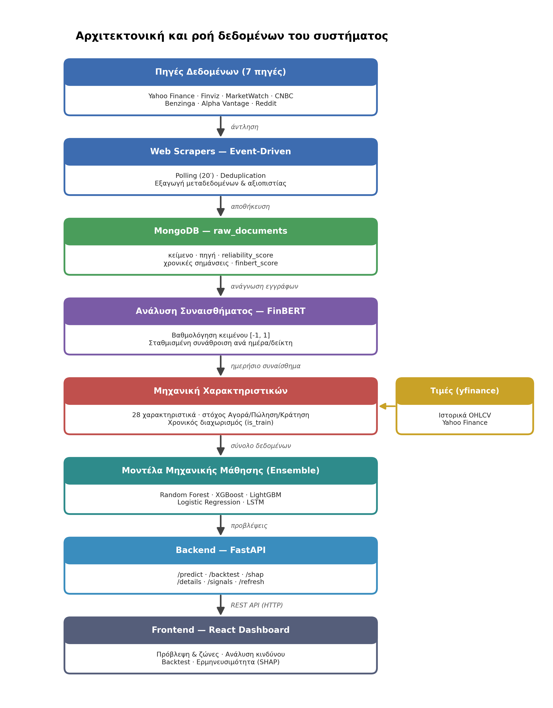
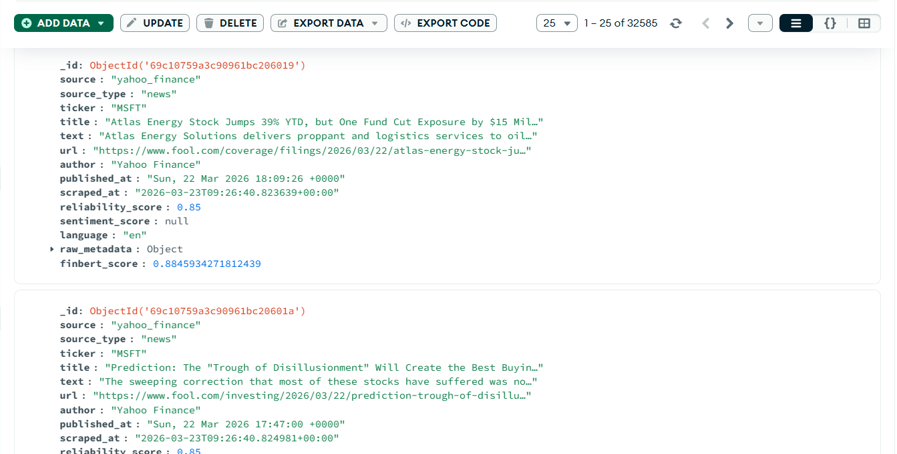
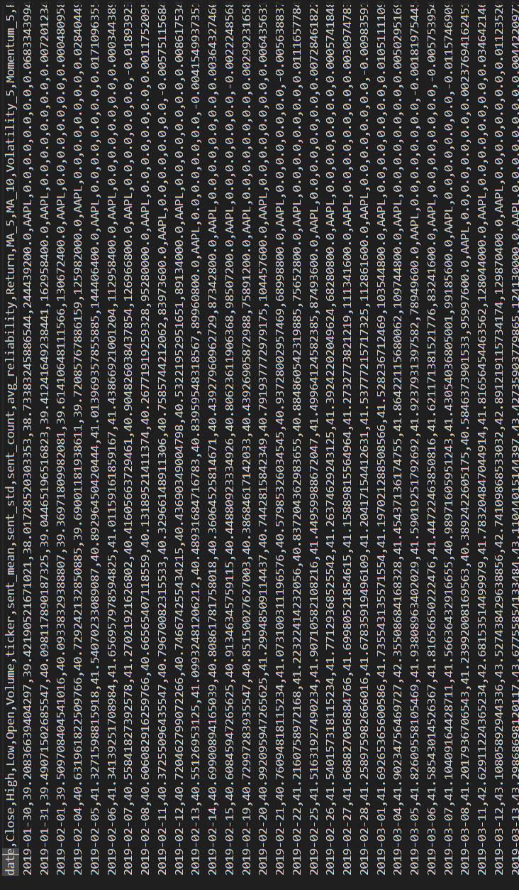

# Κεφάλαιο 3 — Σχεδιασμός συστήματος

Στο κεφάλαιο αυτό παρουσιάζεται αναλυτικά ο σχεδιασμός του προτεινόμενου συστήματος. Αρχικά περιγράφεται η συνολική αρχιτεκτονική και η ροή των δεδομένων, και στη συνέχεια αναλύονται διεξοδικά τα επιμέρους υποσυστήματα: οι πηγές δεδομένων, ο event-driven μηχανισμός συλλογής, ο εμπλουτισμός με μεταδεδομένα και η αξιολόγηση αξιοπιστίας, η βάση δεδομένων, η διαδικασία ανάλυσης συναισθήματος και, τέλος, η μηχανική χαρακτηριστικών και η δημιουργία του τελικού συνόλου δεδομένων.

## 3.1 Συνολική αρχιτεκτονική συστήματος

Το σύστημα ακολουθεί μια αρθρωτή (modular) αρχιτεκτονική, στην οποία κάθε υποσύστημα επιτελεί έναν σαφώς διακριτό ρόλο και επικοινωνεί με τα υπόλοιπα μέσω καλά ορισμένων διεπαφών. Ο σχεδιασμός αυτός προσφέρει σημαντικά πλεονεκτήματα: διευκολύνει τη συντήρηση, επιτρέπει την ανεξάρτητη ανάπτυξη και δοκιμή κάθε τμήματος, και καθιστά εφικτή τη μελλοντική αντικατάσταση ή επέκταση επιμέρους στοιχείων χωρίς να επηρεάζεται το υπόλοιπο σύστημα.

Η ροή των δεδομένων, από τη συλλογή έως την τελική παρουσίαση στον χρήστη, οργανώνεται σε έξι διαδοχικά στάδια, τα οποία αποτυπώνονται στην Εικόνα 3.1:

1. **Συλλογή δεδομένων.** Event-driven web scrapers αντλούν ειδησεογραφικό περιεχόμενο από επτά πηγές και το αποθηκεύουν, μαζί με τα μεταδεδομένα του, στη βάση δεδομένων. Παράλληλα, τα ιστορικά δεδομένα τιμών αντλούνται από το Yahoo Finance.
2. **Ανάλυση συναισθήματος.** Το μοντέλο FinBERT βαθμολογεί το συναίσθημα κάθε εγγράφου. Οι βαθμολογίες σταθμίζονται με βάση την αξιοπιστία της πηγής και συναθροίζονται ανά ημέρα και ανά δείκτη.
3. **Μηχανική χαρακτηριστικών.** Τα ημερήσια δεδομένα συναισθήματος συνδυάζονται με τα δεδομένα τιμών και υπολογίζεται ένα σύνολο 28 χαρακτηριστικών, μαζί με τη μεταβλητή-στόχο.
4. **Εκπαίδευση μοντέλων.** Πέντε μοντέλα ταξινόμησης και νευρωνικά δίκτυα LSTM εκπαιδεύονται στο τελικό σύνολο δεδομένων.
5. **Εξυπηρέτηση προβλέψεων.** Μια υπηρεσία FastAPI φορτώνει τα εκπαιδευμένα μοντέλα και παράγει, κατόπιν αιτήματος, την πρόβλεψη, την προβολή τιμής, την ανάλυση κινδύνου και τις επεξηγήσεις.
6. **Οπτικοποίηση.** Μια εφαρμογή React παρουσιάζει τα αποτελέσματα στον χρήστη μέσω διαδραστικών γραφημάτων.


*Εικόνα 3.1: Αρχιτεκτονική και ροή δεδομένων του συστήματος.*

## 3.2 Πηγές δεδομένων

### 3.2.1 Κατηγορίες πηγών

Σύμφωνα με τους στόχους της εργασίας, το σύστημα αντλεί δεδομένα από πολλαπλές και ετερογενείς πηγές, οι οποίες καλύπτουν και τις τρεις βασικές κατηγορίες που ορίζει η εκφώνηση:

- **Χρηματιστηριακές πλατφόρμες:** Το Yahoo Finance (μέσω της βιβλιοθήκης yfinance) παρέχει τόσο τα ιστορικά δεδομένα τιμών όσο και σχετικές ειδήσεις. Το Finviz λειτουργεί ως συγκεντρωτής ειδήσεων ανά μετοχή, ενώ το MarketWatch παρέχει χρηματοοικονομικό ρεπορτάζ.
- **Ειδησεογραφικές ιστοσελίδες:** Το CNBC και η Benzinga προσφέρουν ροές RSS με οικονομικές ειδήσεις, ενώ το Alpha Vantage παρέχει, μέσω προγραμματιστικής διεπαφής, ειδησεογραφικά δεδομένα με ιστορικό βάθος.
- **Κοινωνικά δίκτυα:** Το Reddit, και συγκεκριμένα οι σχετικές με τις επενδύσεις υποκοινότητες (subreddits), αποτελεί την πηγή κοινωνικού συναισθήματος.

Η ποικιλία αυτή εξασφαλίζει ότι το σύστημα δεν βασίζεται σε μία μόνο οπτική, αλλά συνθέτει την πληροφορία από θεσμικές, εξειδικευμένες και κοινωνικές πηγές, καθεμία με διαφορετικά χαρακτηριστικά αξιοπιστίας και ταχύτητας.

### 3.2.2 Επιλογή δεικτών

Η ανάλυση επικεντρώνεται σε δώδεκα δείκτες της αμερικανικής αγοράς. Πρόκειται για δέκα μεμονωμένες μετοχές μεγάλης κεφαλαιοποίησης του τεχνολογικού κυρίως κλάδου — AAPL (Apple), MSFT (Microsoft), AMZN (Amazon), GOOGL (Alphabet), TSLA (Tesla), NVDA (Nvidia), META (Meta), NFLX (Netflix), AMD και INTC (Intel) — καθώς και δύο διαπραγματεύσιμα αμοιβαία κεφάλαια δεικτών (ETF): το SPY, που παρακολουθεί τον δείκτη S&P 500, και το QQQ, που παρακολουθεί τον Nasdaq-100. Η επιλογή αυτή εξασφαλίζει υψηλή ρευστότητα, πλούσια ειδησεογραφική κάλυψη και ποικιλία συμπεριφορών, ενώ η συμπερίληψη των δύο ETF επιτρέπει τη σύγκριση της συμπεριφοράς μεμονωμένων μετοχών με ευρύτερους δείκτες της αγοράς.

### 3.2.3 Συγκεντρωτικά στοιχεία πηγών

Ο Πίνακας 3.1 συνοψίζει τις πηγές, την κατηγορία τους, τον βαθμό αξιοπιστίας που τους αποδίδεται και το πλήθος των εγγράφων που είχαν συλλεχθεί κατά την τελική φάση της εργασίας.

**Πίνακας 3.1: Πηγές δεδομένων, κατηγορία, αξιοπιστία και πλήθος εγγράφων.**

| Πηγή | Κατηγορία | Αξιοπιστία | Έγγραφα |
|---|---|---|---|
| Alpha Vantage | Ειδησεογραφική / API | 0.92 | 13.521 |
| Finviz | Χρηματιστηριακή πλατφόρμα | 0.80 | 9.149 |
| Yahoo Finance | Χρηματιστηριακή πλατφόρμα | 0.85 | 3.155 |
| MarketWatch | Ειδησεογραφική | 0.80 | 2.845 |
| Reddit | Κοινωνικό δίκτυο | 0.60 | 2.309 |
| CNBC | Ειδησεογραφική | 0.90 | 185 |
| Benzinga | Ειδησεογραφική | 0.85 | 85 |
| **Σύνολο** | | | **≈ 31.250** |

Παρατηρείται ότι ο όγκος των δεδομένων διαφέρει σημαντικά ανά πηγή. Το Alpha Vantage και το Finviz συνεισφέρουν το μεγαλύτερο μέρος του συνόλου, χάρη στο ιστορικό βάθος και στην ανά-μετοχή οργάνωσή τους αντίστοιχα. Αντίθετα, οι ροές RSS του CNBC και της Benzinga έχουν μικρότερη απόδοση, καθώς πρόκειται για γενικές ειδησεογραφικές ροές, από τις οποίες φιλτράρονται μόνο τα άρθρα που αναφέρονται στους συγκεκριμένους δείκτες.

## 3.3 Event-driven μηχανισμός συλλογής δεδομένων

### 3.3.1 Λογική event-driven και περιοδικός έλεγχος

Κάθε πηγή εξυπηρετείται από έναν αυτόνομο scraper. Οι scrapers λειτουργούν με event-driven λογική: εκτελούν περιοδικό έλεγχο (polling) της πηγής ανά τακτά διαστήματα και, όταν εντοπίζουν νέα δεδομένα, ενεργοποιούν ένα «γεγονός» (event) εισαγωγής τους στη βάση. Συγκεκριμένα, κάθε scraper επαναλαμβάνει τον έλεγχο ανά είκοσι λεπτά και, εφόσον εντοπιστούν νέα έγγραφα, αυτά καταχωρούνται και καταγράφεται αντίστοιχο μήνυμα γεγονότος (π.χ. `NEW_FINVIZ_DOCUMENTS_FOUND`). Η προσέγγιση αυτή υλοποιεί πρακτικά την έννοια του event-driven συστήματος: η ενέργεια (αποθήκευση και επεξεργασία) πυροδοτείται από το γεγονός της εμφάνισης νέων δεδομένων. Ο βρόχος παρακολούθησης κάθε scraper έχει την ακόλουθη, απλή μορφή:

```python
def start_polling():
    while True:
        new_docs = scrape_finviz()            # έλεγχος της πηγής
        handle_new_documents_event(new_docs)  # γεγονός: εισαγωγή νέων εγγράφων
        time.sleep(POLL_INTERVAL_SECONDS)     # αναμονή 20 λεπτών
```

**Διασαφήνιση ορολογίας.** Ο όρος «event-driven» εδώ χρησιμοποιείται με την έννοια ότι η επεξεργασία **πυροδοτείται από το γεγονός της εμφάνισης νέων δεδομένων** και όχι από αίτημα του χρήστη. Πρέπει, ωστόσο, να τονιστεί ότι η ανίχνευση των γεγονότων αυτών υλοποιείται με **περιοδικό έλεγχο (polling)** ανά είκοσι λεπτά, και **όχι** με μηχανισμό άμεσης ειδοποίησης (webhooks, message broker τύπου Kafka/RabbitMQ ή WebSockets). Η επιλογή του polling είναι συνειδητή και κατάλληλη για το πρόβλημα, καθώς οι πηγές (ειδησεογραφικά RSS, σελίδες αγοράς) δεν προσφέρουν push-ειδοποιήσεις και τα χρηματιστηριακά δεδομένα ανανεώνονται σε κλίμακα λεπτών. Συνεπώς, το σύστημα είναι event-driven ως προς τη **λογική ροής** του (data-triggered), αλλά **polling-based** ως προς τον μηχανισμό ανίχνευσης — διάκριση που γίνεται ρητή ώστε ο τίτλος να μην παρερμηνευθεί ως υλοποίηση αρχιτεκτονικής πραγματικών συμβάντων (real-time event streaming).

### 3.3.2 Αποφυγή διπλοεγγραφών και ανίχνευση παλαιότητας

Για την αποφυγή διπλοεγγραφών, κάθε scraper εφαρμόζει έλεγχο μοναδικότητας (deduplication), συνήθως με βάση τη διεύθυνση URL του άρθρου ή τον συνδυασμό πηγής, τίτλου και ημερομηνίας. Έτσι, μόνο τα πραγματικά νέα έγγραφα προστίθενται στη βάση, αποτρέποντας την τεχνητή διόγκωση του συνόλου δεδομένων.

Επιπλέον, στο στάδιο της ζωντανής πρόβλεψης, το σύστημα διαθέτει μηχανισμό ανίχνευσης παλαιότητας (staleness detection): πριν από κάθε πρόβλεψη ελέγχεται αν τα αποθηκευμένα δεδομένα τιμών είναι επίκαιρα. Αν διαπιστωθεί ότι είναι παλαιότερα από την τελευταία ημέρα διαπραγμάτευσης, ενεργοποιείται αυτόματα νέα λήψη, ώστε η πρόβλεψη να βασίζεται πάντοτε στα πιο πρόσφατα διαθέσιμα δεδομένα.

### 3.3.3 Τεχνικές προσπέλασης ανά πηγή

Οι πηγές προσπελαύνονται με διαφορετικές τεχνικές, ανάλογα με τη δομή τους. Για τις ιστοσελίδες που επιστρέφουν HTML (Finviz, MarketWatch) χρησιμοποιείται ανάλυση του κώδικα με τη βιβλιοθήκη BeautifulSoup. Για τις πηγές που παρέχουν ροές RSS (CNBC, Benzinga) εφαρμόζεται ανάλυση XML. Για το Reddit αντλούνται οι αναρτήσεις των σχετικών υποκοινοτήτων.

Ιδιαίτερη πρόκληση αποτελεί η ορθή αντιστοίχιση κάθε άρθρου με τον σωστό δείκτη. Για τις περισσότερες πηγές, η αντιστοίχιση γίνεται με βάση το σύμβολο της μετοχής. Ωστόσο, στο Reddit οι αναρτήσεις σπανίως αναφέρουν το σύμβολο (π.χ. «AAPL»), αλλά συνηθέστερα το όνομα της εταιρείας (π.χ. «Apple»). Για τον λόγο αυτό, αναπτύχθηκε ειδικός μηχανισμός αναγνώρισης, ο οποίος αντιστοιχίζει εμπορικές ονομασίες και σχετικούς όρους στους αντίστοιχους δείκτες, αυξάνοντας σημαντικά το ποσοστό των αξιοποιήσιμων αναρτήσεων.

## 3.4 Εμπλουτισμός με μεταδεδομένα και αξιολόγηση αξιοπιστίας

Πέρα από το ίδιο το κείμενο, κάθε έγγραφο εμπλουτίζεται με μεταδεδομένα που υποστηρίζουν την αξιολόγηση της ποιότητας της πληροφορίας — μια απαίτηση που τίθεται ρητά στους στόχους της εργασίας. Τα βασικότερα μεταδεδομένα είναι η **προέλευση** (η πηγή), η **χρονική σήμανση** δημοσίευσης και συλλογής, και ο **βαθμός αξιοπιστίας** της πηγής.

Ο βαθμός αξιοπιστίας αντικατοπτρίζει τη γενικότερη εγκυρότητα και συνέπεια κάθε πηγής. Στους θεσμικούς ειδησεογραφικούς οργανισμούς και στους παρόχους χρηματοοικονομικών δεδομένων αποδίδονται οι υψηλότερες τιμές (Alpha Vantage 0.92, CNBC 0.90), στις εξειδικευμένες πλατφόρμες ενδιάμεσες (Yahoo Finance και Benzinga 0.85, Finviz και MarketWatch 0.80), ενώ στα κοινωνικά δίκτυα, όπου το περιεχόμενο είναι ανεπιβεβαίωτο και υποκειμενικό, η χαμηλότερη (Reddit 0.60).

Είναι σημαντικό να τονιστεί ότι ο βαθμός αυτός δεν αποθηκεύεται απλώς ως πληροφορία, αλλά αξιοποιείται ενεργά από το σύστημα με δύο τρόπους. Πρώτον, χρησιμοποιείται ως **βάρος** κατά τη συνάθροιση του συναισθήματος (ενότητα 3.6), ώστε οι πιο αξιόπιστες πηγές να επηρεάζουν περισσότερο το τελικό σήμα. Δεύτερον, ενσωματώνεται ως **χαρακτηριστικό εισόδου** στα μοντέλα μηχανικής μάθησης, επιτρέποντας στην τεχνητή νοημοσύνη να συνεκτιμά την ποιότητα της πληροφορίας κατά την πρόβλεψη.

Διευκρινίζεται ότι οι τιμές αξιοπιστίας είναι **εμπειρικά (a-priori) ορισμένες** σταθερές, αποδιδόμενες με βάση τον τύπο και τα συντακτικά πρότυπα κάθε πηγής (θεσμικός ειδησεογραφικός οργανισμός έναντι συναθροιστή έναντι ανοιχτού κοινωνικού δικτύου), και παραμένουν **σταθερές** καθ' όλη τη διάρκεια της μελέτης — δεν μαθαίνονται από τα δεδομένα. Η επιλογή αυτή είναι διαφανής και ερμηνεύσιμη, αλλά αποτελεί σχεδιαστική παραδοχή· για τον λόγο αυτό, στο Κεφάλαιο 6 (ενότητα 6.8) η συγκεκριμένη στάθμιση **συγκρίνεται εμπειρικά** με μια απλή μη σταθμισμένη συνάθροιση και με ένα σχήμα όπου τα βάρη μαθαίνονται από τα δεδομένα, ώστε να αποτιμηθεί η πραγματική της συνεισφορά.

## 3.5 Σχεδιασμός βάσης δεδομένων

### 3.5.1 Επιλογή βάσης NoSQL

Τα δεδομένα που συλλέγονται αποθηκεύονται στη βάση MongoDB, στη συλλογή (collection) `raw_documents`. Η επιλογή μιας βάσης τύπου NoSQL, αντί μιας κλασικής σχεσιακής βάσης, υπαγορεύτηκε από τη φύση των δεδομένων. Τα έγγραφα προέρχονται από ετερογενείς πηγές και παρουσιάζουν διαφορετική δομή: ορισμένα διαθέτουν πλήρες κείμενο, άλλα μόνο τίτλο, ορισμένα διαθέτουν συντάκτη, άλλα όχι. Το μοντέλο εγγράφων της MongoDB επιτρέπει την ομοιόμορφη αποθήκευση τέτοιων ετερογενών δεδομένων χωρίς αυστηρά προκαθορισμένο σχήμα, προσφέροντας την απαραίτητη ευελιξία.

### 3.5.2 Δομή του εγγράφου

Κάθε έγγραφο της συλλογής περιλαμβάνει τα ακόλουθα βασικά πεδία:

- `source`, `source_type`: η προέλευση και η κατηγορία της πηγής
- `ticker`: ο δείκτης (ή οι δείκτες) με τον/τους οποίο/ους σχετίζεται το έγγραφο
- `title`, `text`: ο τίτλος και το κείμενο του άρθρου
- `url`, `author`: η διεύθυνση και ο συντάκτης
- `published_at`, `scraped_at`: οι χρονικές σημάνσεις δημοσίευσης και συλλογής
- `reliability_score`: ο βαθμός αξιοπιστίας της πηγής
- `finbert_score`: η βαθμολογία συναισθήματος (συμπληρώνεται στο στάδιο της ανάλυσης)
- `language`, `raw_metadata`: η γλώσσα και τυχόν πρόσθετα μεταδεδομένα

Ένα παράδειγμα της δομής των αποθηκευμένων εγγράφων φαίνεται στην Εικόνα 3.2.


*Εικόνα 3.2: Παράδειγμα αποθηκευμένων εγγράφων στη βάση MongoDB (collection raw_documents).*

## 3.6 Ανάλυση συναισθήματος

### 3.6.1 Βαθμολόγηση με FinBERT

Η διαδικασία ανάλυσης συναισθήματος μετατρέπει το αδόμητο κείμενο σε ποσοτικά χαρακτηριστικά. Για κάθε έγγραφο της βάσης, το μοντέλο FinBERT επεξεργάζεται το κείμενο και υπολογίζει τις πιθανότητες θετικού, αρνητικού και ουδέτερου συναισθήματος. Από αυτές παράγεται ένας **σύνθετος βαθμός** (compound score), ο οποίος ορίζεται ως η διαφορά της πιθανότητας θετικού μείον την πιθανότητα αρνητικού, με εύρος τιμών από -1 (έντονα αρνητικό) έως +1 (έντονα θετικό). Οι βαθμολογίες αποθηκεύονται στο πεδίο `finbert_score` κάθε εγγράφου, ώστε να μην απαιτείται επανυπολογισμός σε επόμενες εκτελέσεις — μια βελτιστοποίηση που εξοικονομεί σημαντικό υπολογιστικό χρόνο. Ο υπολογισμός του σύνθετου βαθμού φαίνεται παρακάτω:

```python
# FinBERT: 0 = θετικό, 1 = αρνητικό, 2 = ουδέτερο
probs = F.softmax(logits, dim=-1).numpy()
# σύνθετος βαθμός = P(θετικό) - P(αρνητικό), εύρος [-1, 1]
scores = [float(p[0] - p[1]) for p in probs]
```

### 3.6.2 Σταθμισμένη ως προς την αξιοπιστία συνάθροιση

Επειδή τα μοντέλα πρόβλεψης λειτουργούν σε ημερήσια βάση, τα βαθμολογημένα έγγραφα πρέπει να συναθροιστούν **ανά ημέρα και ανά δείκτη**. Η συνάθροιση αυτή είναι **σταθμισμένη ως προς την αξιοπιστία**: αντί ενός απλού μέσου όρου, υπολογίζεται ένας σταθμισμένος μέσος όρος, στον οποίο κάθε έγγραφο συνεισφέρει ανάλογα με τον βαθμό αξιοπιστίας της πηγής του. Έτσι, μια είδηση από το Alpha Vantage επηρεάζει το ημερήσιο συναίσθημα περισσότερο από μια ανάρτηση στο Reddit.

Για κάθε ζεύγος ημέρας–δείκτη υπολογίζονται τέσσερα μεγέθη: ο σταθμισμένος μέσος όρος συναισθήματος (`sent_mean`), η σταθμισμένη τυπική απόκλιση (`sent_std`, που αποτυπώνει τη διαφωνία μεταξύ των πηγών), το πλήθος των άρθρων (`sent_count`, που αποτυπώνει την ένταση της κάλυψης) και ο μέσος βαθμός αξιοπιστίας (`avg_reliability`). Η σταθμισμένη συνάθροιση υλοποιείται ως εξής:

```python
def weighted_agg(group):
    w = group["reliability"].values   # βάρη = αξιοπιστία πηγής
    s = group["sentiment"].values     # βαθμοί συναισθήματος FinBERT
    w_mean   = float(np.average(s, weights=w))            # σταθμισμένος μέσος
    variance = float(np.average((s - w_mean)**2, weights=w))
    return pd.Series({
        "sent_mean":       w_mean,
        "sent_std":        np.sqrt(variance),
        "sent_count":      float(len(group)),
        "avg_reliability": float(w.mean()),
    })
```

Τα μεγέθη αυτά αποτελούν τη γέφυρα μεταξύ της κειμενικής πληροφορίας και των αριθμητικών μοντέλων.

## 3.7 Μηχανική χαρακτηριστικών και δημιουργία συνόλου δεδομένων

### 3.7.1 Συνδυασμός τιμών και συναισθήματος

Στο τελικό στάδιο σχεδιασμού, τα ημερήσια δεδομένα συναισθήματος συνδυάζονται με τα ιστορικά δεδομένα τιμών κάθε δείκτη. Η σύζευξη γίνεται με βάση την ημερομηνία και τον δείκτη· για τις ημέρες κατά τις οποίες δεν υπάρχει διαθέσιμη ειδησεογραφική κάλυψη, τα χαρακτηριστικά συναισθήματος λαμβάνουν μηδενική τιμή. Με βάση τον συνδυασμό αυτό, υπολογίζεται ένα σύνολο **28 χαρακτηριστικών**.

**Χρονική αντιστοίχιση ειδήσεων με συνεδριάσεις.** Η ορθή χρονική ευθυγράμμιση είναι κρίσιμη για την αποφυγή look-ahead bias. Στην παρούσα υλοποίηση, η ημερομηνία κάθε εγγράφου προκύπτει από το πεδίο δημοσίευσης (`published_at`, με εφεδρική χρήση του `scraped_at`), κανονικοποιείται σε UTC και ανάγεται σε **ημερολογιακή ημέρα**. Το συναίσθημα της ημέρας *D* αντιστοιχίζεται στα χαρακτηριστικά της συνεδρίασης *D* και χρησιμοποιείται για την πρόβλεψη της απόδοσης του ορίζοντα *D+5*. Επειδή ο στόχος αφορά πέντε ημέρες **μπροστά**, δεν υπάρχει διαρροή μελλοντικής πληροφορίας. Ειδήσεις που δημοσιεύονται σε μη εργάσιμες ημέρες (Σαββατοκύριακα/αργίες) δεν αντιστοιχίζονται σε συνεδρίαση κατά τη σύζευξη με τις ημέρες διαπραγμάτευσης. Αναγνωρίζεται, ως **περιορισμός**, ότι το σύστημα λειτουργεί σε ανάλυση ημέρας και **δεν διαχωρίζει** αν μια είδηση δημοσιεύθηκε πριν ή μετά το κλείσιμο της αγοράς· δεδομένου όμως του πενθήμερου ορίζοντα πρόβλεψης, η επίδραση μιας τέτοιας ενδοημερήσιας αστοχίας είναι αμελητέα.

### 3.7.2 Τα 28 χαρακτηριστικά

Τα χαρακτηριστικά ομαδοποιούνται σε έξι κατηγορίες, όπως φαίνεται στον Πίνακα 3.2. Οι πρώτες πέντε κατηγορίες προέρχονται από τα δεδομένα τιμών (τεχνικά χαρακτηριστικά), ενώ η έκτη από την ανάλυση συναισθήματος.

Ο Πίνακας 3.2 συνοψίζει τις έξι ομάδες στις οποίες οργανώνονται τα 28 χαρακτηριστικά.

**Πίνακας 3.2: Οι έξι ομάδες των 28 χαρακτηριστικών.**

| Ομάδα | Πλήθος | Χαρακτηριστικά |
|---|---|---|
| Τιμή & Όγκος | 5 | Close, High, Low, Open, Volume |
| Τάση & Ορμή | 6 | Return, MA_5, MA_10, Momentum_5, Return_lag_1, Return_lag_2 |
| Ταλαντωτές | 3 | RSI_14, MACD, MACD_signal |
| Μεταβλητότητα | 2 | Volatility_5, BB_percent |
| Λόγοι Όγκου/Εύρους | 3 | Volume_Ratio, High_ratio, Low_ratio |
| Συναίσθημα (NLP) | 9 | sent_mean, sent_std, sent_count, avg_reliability, sentiment_lag_1, sentiment_lag_2, sentiment_3d, sentiment_7d, sentiment_momentum |

Τα τεχνικά χαρακτηριστικά αποτυπώνουν την τάση, την ορμή, τη μεταβλητότητα και τις σχέσεις όγκου της τιμής. Τα χαρακτηριστικά συναισθήματος, πέρα από το ίδιο το ημερήσιο συναίσθημα, περιλαμβάνουν χρονικές υστερήσεις (lag) και κυλιόμενους μέσους όρους (3 και 7 ημερών), ώστε να αποτυπώνεται και η εξέλιξη του συναισθήματος στον χρόνο. Ενδεικτικά, ο υπολογισμός του δείκτη σχετικής ισχύος (RSI) υλοποιείται ως εξής:

```python
def compute_rsi(series, window=14):
    delta = series.diff()
    gain  = (delta.where(delta > 0, 0)).rolling(window).mean()
    loss  = (-delta.where(delta < 0, 0)).rolling(window).mean()
    rs    = gain / loss
    return 100 - (100 / (1 + rs))
```

### 3.7.3 Ορισμός της μεταβλητής-στόχου

Η μεταβλητή-στόχος (target) ορίζεται με βάση τη μελλοντική απόδοση της τιμής σε ορίζοντα πέντε ημερών διαπραγμάτευσης. Συγκεκριμένα, υπολογίζεται η ποσοστιαία μεταβολή της τιμής κλεισίματος μετά από πέντε ημέρες και κατηγοριοποιείται ως εξής: μεταβολή μεγαλύτερη του +2% αντιστοιχεί σε σήμα **«Αγορά»**, μεταβολή μικρότερη του -2% σε σήμα **«Πώληση»**, ενώ οι ενδιάμεσες τιμές σε σήμα **«Κράτηση»**. Το κατώφλι του ±2% επιλέχθηκε ώστε να φιλτράρει τις ασήμαντες διακυμάνσεις και να εστιάζει σε ουσιαστικές κινήσεις της αγοράς.

### 3.7.4 Χρονικός διαχωρισμός εκπαίδευσης και ελέγχου

Το τελικό σύνολο δεδομένων περιλαμβάνει **22.224 εγγραφές** (περίπου 1.852 ανά δείκτη). Καθοριστική σχεδιαστική απόφαση αποτελεί ο **χρονικός διαχωρισμός** των δεδομένων: για κάθε δείκτη ξεχωριστά, το πρώτο 80% των εγγραφών (κατά χρονολογική σειρά) χρησιμοποιείται για εκπαίδευση και το τελευταίο 20% για έλεγχο. Η πληροφορία αυτή αποθηκεύεται σε ειδική στήλη του συνόλου δεδομένων, ώστε όλα τα μοντέλα και η διαδικασία αξιολόγησης να χρησιμοποιούν τον ίδιο ακριβώς διαχωρισμό.

Η επιλογή του χρονικού (και όχι τυχαίου) διαχωρισμού είναι κρίσιμη και αποτελεί θεμελιώδη αρχή στην ανάλυση χρονοσειρών. Ένας τυχαίος διαχωρισμός θα επέτρεπε στο μοντέλο να «δει» μελλοντικά δεδομένα κατά την εκπαίδευση, προκαλώντας διαρροή πληροφορίας (data leakage) και τεχνητά διογκωμένα αποτελέσματα. Ο χρονικός διαχωρισμός, αντιθέτως, προσομοιώνει πιστά την πραγματική συνθήκη, στην οποία το μοντέλο καλείται να προβλέψει το άγνωστο μέλλον με βάση το γνωστό παρελθόν.

Ένα ενδεικτικό απόσπασμα του τελικού συνόλου δεδομένων παρουσιάζεται στην Εικόνα 3.3.


*Εικόνα 3.3: Απόσπασμα του τελικού συνόλου δεδομένων (final_dataset.csv) με τις στήλες χαρακτηριστικών και τη στήλη σήματος.*

### 3.7.5 Υλοποίηση: το σενάριο κατασκευής δεδομένων (merge_dataset.py)

Ολόκληρη η διαδικασία μηχανικής χαρακτηριστικών συγκεντρώνεται σε ένα σενάριο, το `merge_dataset.py`, το οποίο εκτελείται μία φορά και παράγει το τελικό αρχείο `final_dataset.csv`. Για κάθε δείκτη ξεχωριστά, το σενάριο: (1) φορτώνει τα ακατέργαστα δεδομένα τιμών (OHLCV), (2) τα συγχωνεύει με το ημερήσιο συναίσθημα ως προς την ημερομηνία, (3) υπολογίζει τους τεχνικούς δείκτες και τα χαρακτηριστικά συναισθήματος, (4) ορίζει τη μεταβλητή-στόχο και (5) σημειώνει τον χρονικό διαχωρισμό.

Η συγχώνευση τιμών–συναισθήματος γίνεται με **αριστερή σύζευξη** (left join), ώστε να διατηρούνται όλες οι ημέρες διαπραγμάτευσης ακόμη κι όταν για κάποια ημέρα δεν υπάρχει είδηση· οι ελλείπουσες τιμές συναισθήματος συμπληρώνονται με μηδέν:

```python
merged = pd.merge(df, ticker_sent, on="date", how="left")   # κράτα όλες τις ημέρες
merged["sent_mean"]  = merged["sent_mean"].fillna(0)         # 0 όπου δεν υπάρχει είδηση
merged["sent_count"] = merged["sent_count"].fillna(0)
```

Στη συνέχεια, τα χαρακτηριστικά υπολογίζονται με διανυσματικές πράξεις της pandas — οι τεχνικοί δείκτες μέσω βοηθητικών συναρτήσεων (`compute_rsi`, `compute_macd`, `compute_bb_percent`):

```python
merged["Return"]       = merged["Close"].pct_change()
merged["MA_5"]         = merged["Close"].rolling(5).mean()
merged["Volatility_5"] = merged["Return"].rolling(5).std()
merged["RSI_14"]       = compute_rsi(merged["Close"])
merged["MACD"], merged["MACD_signal"] = compute_macd(merged["Close"])
merged["BB_percent"]   = compute_bb_percent(merged["Close"])
```

Τέλος, ορίζεται η μεταβλητή-στόχος: η απόδοση των επόμενων πέντε ημερών κατηγοριοποιείται μέσω της `classify_return` με κατώφλι ±2%. Αξίζει να σημειωθεί ότι η εσωτερική κωδικοποίηση εδώ είναι {-1, 0, +1} (Πώληση/Κράτηση/Αγορά), η οποία διαφέρει από την κωδικοποίηση {0, 1, 2} των μοντέλων — μια διαφορά που, όπως αναλύεται στο Κεφάλαιο 7, χρειάστηκε ιδιαίτερη προσοχή κατά την αξιολόγηση:

```python
def classify_return(x):
    if x > 0.02:    return 1     # Αγορά
    elif x < -0.02: return -1    # Πώληση
    else:           return 0     # Κράτηση

merged["future_return"] = merged["Close"].shift(-5) / merged["Close"] - 1
merged["signal"] = merged["future_return"].apply(classify_return)
```

## 3.8 Συμπεράσματα

Ο σχεδιασμός που παρουσιάστηκε συνδυάζει μια αρθρωτή αρχιτεκτονική με αυτοματοποιημένη, event-driven συλλογή δεδομένων από επτά ετερογενείς πηγές, εμπλουτισμό με μεταδεδομένα αξιοπιστίας, ανάλυση συναισθήματος μέσω FinBERT και μια προσεκτικά σχεδιασμένη διαδικασία μηχανικής χαρακτηριστικών. Δύο σχεδιαστικές αποφάσεις ξεχωρίζουν για τη σημασία τους: η σταθμισμένη ως προς την αξιοπιστία συνάθροιση του συναισθήματος, η οποία ενσωματώνει την ποιότητα της πληροφορίας στην ανάλυση, και ο αυστηρός χρονικός διαχωρισμός των δεδομένων, ο οποίος θεμελιώνει την εγκυρότητα των αποτελεσμάτων που παρουσιάζονται στα επόμενα κεφάλαια.
