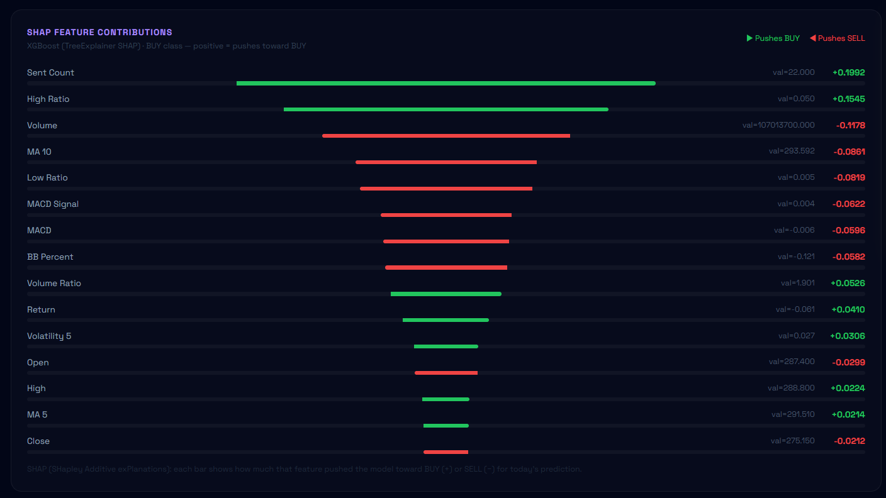
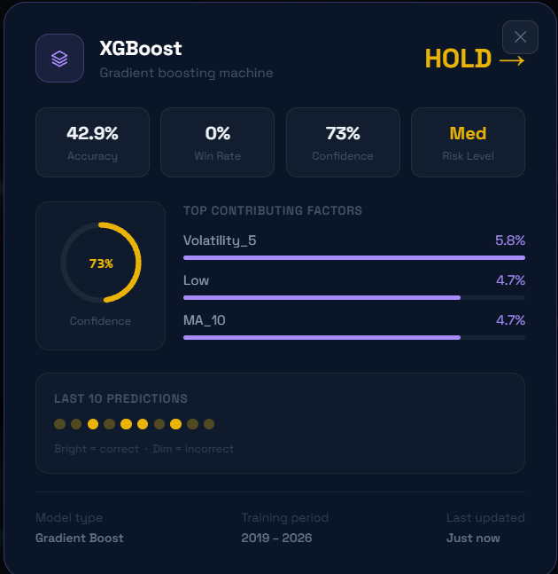
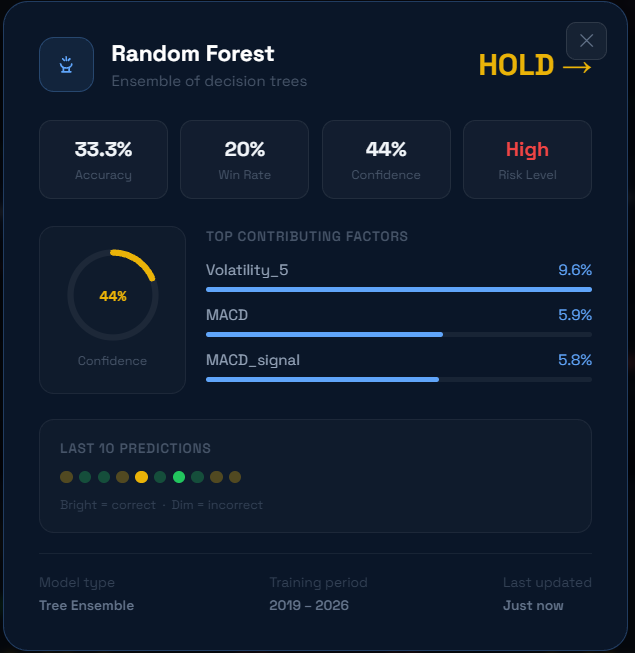
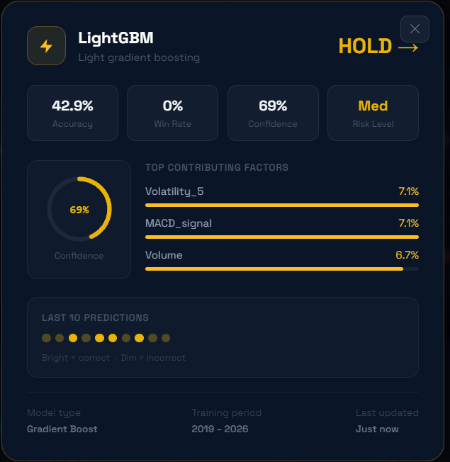
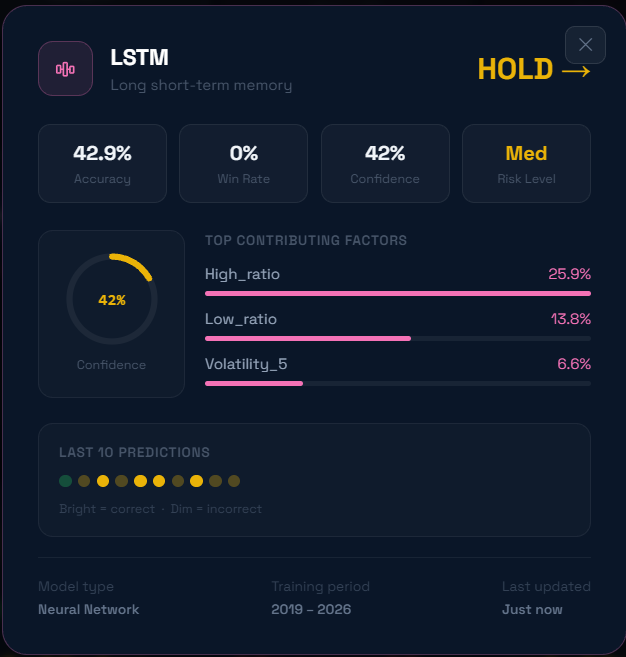
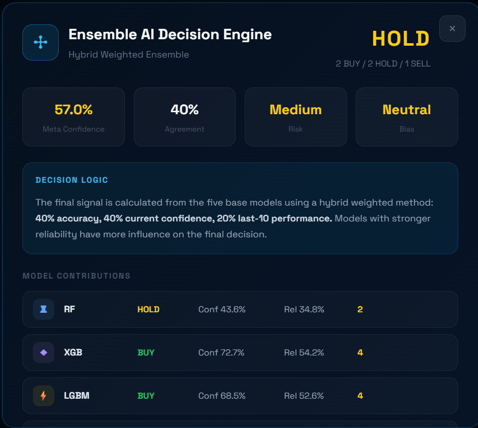

# Κεφάλαιο 4 — Υλοποίηση και εκπαίδευση μοντέλων

Στο κεφάλαιο αυτό παρουσιάζεται διεξοδικά η υλοποίηση και η εκπαίδευση των μοντέλων μηχανικής μάθησης που αποτελούν τον πυρήνα του συστήματος. Αναλύονται η διαμόρφωση του προβλήματος, η προεπεξεργασία των δεδομένων, η θεωρητική θεμελίωση και οι ακριβείς υπερπαράμετροι κάθε μοντέλου, η μεθοδολογία εκπαίδευσης, τα νευρωνικά δίκτυα παλινδρόμησης για την πρόβλεψη τιμής, και τέλος τα ποσοτικά αποτελέσματα, ο μηχανισμός συνδυασμού και η μελέτη απομόνωσης.

## 4.1 Διαμόρφωση του προβλήματος

Το πρόβλημα της πρόβλεψης διατυπώνεται ως **ταξινόμηση τριών κατηγοριών** (multi-class classification). Για κάθε ημέρα *t* και δείκτη, υπολογίζεται η μελλοντική απόδοση σε ορίζοντα πέντε ημερών διαπραγμάτευσης:

```
r(t) = Close(t+5) / Close(t) - 1
```

Η συνεχής αυτή τιμή κατηγοριοποιείται στη μεταβλητή-στόχο *y* ως εξής:

```
y = «Αγορά»    αν  r(t) > +0.02
y = «Πώληση»   αν  r(t) < -0.02
y = «Κράτηση»  διαφορετικά
```

Το κατώφλι του ±2% επιλέχθηκε ώστε να φιλτράρει τον θόρυβο των μικρών διακυμάνσεων και να εστιάζει σε ουσιαστικές κινήσεις. Εσωτερικά, οι ετικέτες κωδικοποιούνται ως {0: Πώληση, 1: Κράτηση, 2: Αγορά}, μια λεπτομέρεια που, όπως θα δούμε στο Κεφάλαιο 7, υπήρξε πηγή σφάλματος στην αξιολόγηση.

**Όρια αναφοράς (baselines).** Κάθε μοντέλο αξιολογείται σε σχέση με δύο όρια. Το πρώτο είναι η **τυχαία πρόβλεψη**, που για τρεις ισοπίθανες κατηγορίες δίνει ακρίβεια 33.3%. Το δεύτερο, αυστηρότερο, είναι η **βασική γραμμή πλειοψηφίας**: η ακρίβεια ενός τετριμμένου μοντέλου που προβλέπει πάντα την πιο συχνή κατηγορία. Στο σύνολο ελέγχου η κατανομή είναι «Κράτηση» 37.9%, «Αγορά» 33.7%, «Πώληση» 28.3%, άρα η βασική γραμμή πλειοψηφίας ανέρχεται σε **37.9%**. Ένα μοντέλο έχει πραγματική προγνωστική αξία μόνο εφόσον ξεπερνά και τα δύο όρια.

## 4.2 Προεπεξεργασία και προετοιμασία δεδομένων

Πριν από την εκπαίδευση, τα δεδομένα υφίστανται μια σειρά μετασχηματισμών. Τα δεντρικά μοντέλα (Random Forest, XGBoost, LightGBM) δεν απαιτούν κλιμάκωση των χαρακτηριστικών, καθώς βασίζονται σε διαχωρισμούς κατωφλιού και είναι αναλλοίωτα σε μονότονους μετασχηματισμούς. Αντίθετα, η Logistic Regression και τα νευρωνικά δίκτυα LSTM είναι ευαίσθητα στην κλίμακα των εισόδων και απαιτούν κανονικοποίηση.

Για τη Logistic Regression εφαρμόστηκε **τυποποίηση** (StandardScaler), η οποία μετασχηματίζει κάθε χαρακτηριστικό σε μηδενική μέση τιμή και μοναδιαία τυπική απόκλιση. Για τα LSTM εφαρμόστηκε **κανονικοποίηση ελαχίστου–μεγίστου** (MinMaxScaler) των χαρακτηριστικών στο διάστημα [0, 1]. Κρίσιμης σημασίας είναι ότι όλοι οι μετασχηματιστές προσαρμόζονται **αποκλειστικά στο σύνολο εκπαίδευσης** και στη συνέχεια εφαρμόζονται στο σύνολο ελέγχου, ώστε να αποφεύγεται η διαρροή στατιστικής πληροφορίας (βλ. Κεφάλαιο 7).

Τέλος, για τα δίκτυα LSTM, τα δεδομένα μετασχηματίζονται από μεμονωμένες εγγραφές σε **ακολουθίες** διαδοχικών ημερών, διαδικασία που περιγράφεται αναλυτικά στην ενότητα 4.4.

## 4.3 Τα μοντέλα ταξινόμησης

Για την πρόβλεψη αξιοποιήθηκαν πέντε μοντέλα από διαφορετικές οικογένειες αλγορίθμων, ώστε ο συνδυασμός τους να είναι όσο το δυνατόν πιο αποτελεσματικός.

### 4.3.1 Random Forest

Το Random Forest είναι ένας αλγόριθμος συνόλου τύπου *bagging* (Breiman, 2001). Κατασκευάζει πολλά ανεξάρτητα δέντρα απόφασης, καθένα εκπαιδευμένο σε ένα τυχαίο δείγμα (με επανατοποθέτηση) των δεδομένων και σε ένα τυχαίο υποσύνολο των χαρακτηριστικών σε κάθε διαχωρισμό. Η τελική πρόβλεψη προκύπτει με ψηφοφορία πλειοψηφίας μεταξύ των δέντρων. Η διπλή αυτή τυχαιότητα μειώνει τη συσχέτιση μεταξύ των δέντρων και, κατ' επέκταση, τη διασπορά (variance) του συνόλου, περιορίζοντας την υπερπροσαρμογή. Κάθε δέντρο αναζητά τους διαχωρισμούς που ελαχιστοποιούν την ακαθαρσία Gini των κόμβων.

Στην παρούσα εργασία, το μοντέλο ρυθμίστηκε με **300 δέντρα** (`n_estimators=300`) και μέγιστο βάθος **12** (`max_depth=12`), τιμές που εξισορροπούν την εκφραστικότητα με τον κίνδυνο υπερπροσαρμογής.

### 4.3.2 XGBoost

Το XGBoost (Chen & Guestrin, 2016) ανήκει στην οικογένεια της ενισχυμένης κλιμάκωσης (gradient boosting). Σε αντίθεση με το bagging, τα δέντρα κατασκευάζονται **διαδοχικά**: κάθε νέο δέντρο εκπαιδεύεται ώστε να διορθώσει τα σφάλματα του αθροίσματος των προηγουμένων. Η εκπαίδευση ελαχιστοποιεί μια αντικειμενική συνάρτηση που συνδυάζει μια συνάρτηση απώλειας *L* με έναν όρο κανονικοποίησης *Ω* που τιμωρεί την πολυπλοκότητα των δέντρων:

```
Objective = Σ L(y_i, ŷ_i) + Σ Ω(f_k)
```

Ο όρος κανονικοποίησης αποτελεί ένα από τα βασικά πλεονεκτήματα του XGBoost έναντι παλαιότερων υλοποιήσεων boosting, καθώς περιορίζει την υπερπροσαρμογή. Οι υπερπαράμετροι που χρησιμοποιήθηκαν είναι: **400 δέντρα** (`n_estimators=400`), μέγιστο βάθος **7**, ρυθμός μάθησης **0.03** (`learning_rate`), και υποδειγματοληψία 90% τόσο των εγγραφών (`subsample=0.9`) όσο και των χαρακτηριστικών (`colsample_bytree=0.9`) ανά δέντρο — τεχνικές που ενισχύουν τη γενίκευση. Το μοντέλο εκπαιδεύτηκε με αντικειμενική συνάρτηση `multi:softprob` για τις τρεις κλάσεις.

### 4.3.3 LightGBM

Το LightGBM (Ke et al., 2017) αποτελεί μια εναλλακτική, ιδιαίτερα αποδοτική υλοποίηση gradient boosting. Δύο είναι οι βασικές καινοτομίες του: η ανάπτυξη των δέντρων **κατά φύλλο** (leaf-wise αντί level-wise), που οδηγεί σε ταχύτερη μείωση της απώλειας, και η χρήση **ιστογραμμάτων** για τη διακριτοποίηση των συνεχών χαρακτηριστικών, που επιταχύνει δραματικά την εκπαίδευση και μειώνει τη μνήμη. Χρησιμοποιήθηκαν οι ίδιες βασικές υπερπαράμετροι με το XGBoost (**400 δέντρα, βάθος 7, ρυθμός μάθησης 0.03, υποδειγματοληψία 0.9**), ώστε η σύγκριση των δύο αλγορίθμων να είναι δίκαιη.

### 4.3.4 Logistic Regression

Η λογιστική παλινδρόμηση είναι ένα γραμμικό μοντέλο ταξινόμησης, το οποίο στην πολυκλασική του εκδοχή (multinomial) μοντελοποιεί την πιθανότητα κάθε κλάσης μέσω της συνάρτησης softmax εφαρμοσμένης σε έναν γραμμικό συνδυασμό των χαρακτηριστικών. Παρά την απλότητά της, αποτελεί ένα ισχυρό και πλήρως ερμηνεύσιμο μοντέλο, και η σύγκριση των πιο σύνθετων αλγορίθμων με αυτήν επιτρέπει την αποτίμηση της πραγματικής προστιθέμενης αξίας τους. Εκπαιδεύτηκε με μέγιστο αριθμό επαναλήψεων **1000** (`max_iter=1000`) επί τυποποιημένων χαρακτηριστικών.

### 4.3.5 Νευρωνικό δίκτυο LSTM

Το LSTM είναι ένα αναδρομικό νευρωνικό δίκτυο σχεδιασμένο για ακολουθιακά δεδομένα (Hochreiter & Schmidhuber, 1997). Ο πυρήνας του είναι ένα «κελί μνήμης» που ρυθμίζεται από τρεις πύλες — λήθης (forget), εισόδου (input) και εξόδου (output) — οι οποίες ελέγχουν τη ροή της πληροφορίας στον χρόνο. Για κάθε χρονικό βήμα *t*, οι πύλες υπολογίζονται ως:

```
f_t = σ(W_f · [h_{t-1}, x_t] + b_f)      (πύλη λήθης)
i_t = σ(W_i · [h_{t-1}, x_t] + b_i)      (πύλη εισόδου)
o_t = σ(W_o · [h_{t-1}, x_t] + b_o)      (πύλη εξόδου)
C_t = f_t * C_{t-1} + i_t * tanh(W_C · [h_{t-1}, x_t] + b_C)
h_t = o_t * tanh(C_t)
```

όπου *σ* η σιγμοειδής συνάρτηση. Ο μηχανισμός αυτός επιτρέπει στο δίκτυο να διατηρεί ή να «ξεχνά» πληροφορία σε μεγάλες χρονικές αποστάσεις, αντιμετωπίζοντας το πρόβλημα της εξαφάνισης της κλίσης.

Η αρχιτεκτονική του LSTM ταξινομητή αποτελείται από δύο διαδοχικά επίπεδα LSTM (64 και 32 μονάδων) με ενδιάμεσα επίπεδα dropout (ποσοστού 0.2, για αποφυγή υπερπροσαρμογής) και ένα τελικό επίπεδο softmax τριών κλάσεων:

```python
model = Sequential([
    Input(shape=(SEQUENCE_LENGTH, n_features)),   # 10 ημέρες × 28 χαρακτηριστικά
    LSTM(64, return_sequences=True),
    Dropout(0.2),
    LSTM(32),
    Dropout(0.2),
    Dense(16, activation="relu"),
    Dense(3, activation="softmax"),               # Πώληση / Κράτηση / Αγορά
])
model.compile(optimizer="adam",
              loss="sparse_categorical_crossentropy", metrics=["accuracy"])
```

Η συνάρτηση απώλειας είναι η διασταυρούμενη εντροπία (cross-entropy), κατάλληλη για ταξινόμηση, και ο βελτιστοποιητής ο Adam.

## 4.4 Μεθοδολογία εκπαίδευσης

Η εκπαίδευση όλων των μοντέλων ακολούθησε κοινές, μεθοδολογικά αυστηρές αρχές, ώστε τα αποτελέσματα να είναι συγκρίσιμα και έγκυρα.

### 4.4.1 Χρονικός διαχωρισμός ανά δείκτη

Όπως περιγράφηκε στην ενότητα 3.7, εφαρμόστηκε χρονικός διαχωρισμός ανά δείκτη: το πρώτο 80% των ημερών κάθε δείκτη για εκπαίδευση, το τελευταίο 20% για έλεγχο. Η πληροφορία αποθηκεύεται σε κοινή στήλη (`is_train`), ώστε όλα τα μοντέλα και η αξιολόγηση να χρησιμοποιούν τον ίδιο ακριβώς διαχωρισμό:

```python
train_mask, test_mask = train_test_masks(df)
X_train, X_test = X[train_mask], X[test_mask]
y_train, y_test = y[train_mask], y[test_mask]
```

### 4.4.2 Εξισορρόπηση κλάσεων και ενίσχυση συναισθήματος

Επειδή οι τρεις κατηγορίες δεν είναι ισοπληθείς, εφαρμόστηκε **εξισορρόπηση βαρών** (class weighting). Σε κάθε εγγραφή αποδίδεται βάρος αντιστρόφως ανάλογο της συχνότητας της κλάσης της:

```
w(c) = N / (K · n_c)
```

όπου *N* το πλήθος των εγγραφών, *K* ο αριθμός των κλάσεων και *n_c* το πλήθος των εγγραφών της κλάσης *c*. Έτσι, οι σπανιότερες κατηγορίες αποκτούν μεγαλύτερη βαρύτητα. Επιπλέον, υιοθετήθηκε μια στοχευμένη τεχνική: οι εγγραφές που διαθέτουν πραγματικά δεδομένα συναισθήματος έλαβαν επιπλέον βάρος (×1.5), ώστε τα μοντέλα να αξιοποιούν εντονότερα την πληροφορία αυτή:

```python
sample_weights = compute_sample_weight("balanced", y_train)
sent_boost     = np.where(X_train["sent_mean"].values != 0, 1.5, 1.0)
sample_weights = sample_weights * sent_boost
```

### 4.4.3 Κλιμάκωση χωρίς διαρροή

Όπως αναφέρθηκε, οι μετασχηματιστές κλιμάκωσης προσαρμόστηκαν αποκλειστικά στα δεδομένα εκπαίδευσης και εφαρμόστηκαν στη συνέχεια στο σύνολο ελέγχου. Η λεπτομέρεια αυτή είναι κρίσιμη: η προσαρμογή του μετασχηματιστή σε ολόκληρο το σύνολο θα επέτρεπε σε στατιστικά στοιχεία του μέλλοντος να επηρεάσουν την εκπαίδευση.

### 4.4.4 Κατασκευή ακολουθιών για το LSTM

Το LSTM δέχεται ακολουθίες δέκα διαδοχικών ημερών. Οι ακολουθίες κατασκευάστηκαν **ανά δείκτη**, ώστε καμία να μην συνδυάζει δεδομένα διαφορετικών μετοχών, και η ανάθεσή τους σε εκπαίδευση/έλεγχο έγινε με βάση τη χρονική θέση της ημέρας-στόχου:

```python
for _, grp in df.groupby("ticker", sort=False):
    pos = grp.index.values
    for i in range(seq_len, len(pos)):
        seq   = X_scaled[pos][i-seq_len:i]
        label = y[pos][i]
        if is_train[i]:
            X_train.append(seq); y_train.append(label)
        else:
            X_test.append(seq);  y_test.append(label)
```

### 4.4.5 Πρόωρη διακοπή και κανονικοποίηση

Για τα νευρωνικά δίκτυα, η εκπαίδευση χρησιμοποίησε **πρόωρη διακοπή** (early stopping): η εκπαίδευση τερματίζεται αυτόματα όταν η απόδοση στο σύνολο επικύρωσης πάψει να βελτιώνεται για έναν αριθμό εποχών (patience), επαναφέροντας τα βέλτιστα βάρη. Για τον ταξινομητή ορίστηκαν 40 εποχές (`epochs=40`), μέγεθος παρτίδας 32 (`batch_size=32`), ποσοστό επικύρωσης 20% και υπομονή 5 εποχών. Σε συνδυασμό με τα επίπεδα dropout, ο μηχανισμός αυτός περιορίζει σημαντικά την υπερπροσαρμογή.

## 4.5 Νευρωνικά δίκτυα LSTM παλινδρόμησης

Πέρα από τον LSTM ταξινομητή, αναπτύχθηκαν δύο επιπλέον δίκτυα LSTM **παλινδρόμησης**, τα οποία προβλέπουν συνεχείς τιμές και τροφοδοτούν την καμπύλη πρόβλεψης τιμής της διεπαφής.

### 4.5.1 Μονοβηματικό δίκτυο

Το πρώτο δίκτυο προβλέπει τη συνολική απόδοση των επόμενων πέντε ημερών (μία τιμή). Η αρχιτεκτονική του είναι παρόμοια με του ταξινομητή, αλλά με ένα τελικό γραμμικό νευρώνα εξόδου. Ως συνάρτηση απώλειας χρησιμοποιήθηκε η **απώλεια Huber** (με δ=1.0), η οποία είναι ανθεκτική στις ακραίες τιμές των αποδόσεων: συμπεριφέρεται τετραγωνικά για μικρά σφάλματα και γραμμικά για μεγάλα, περιορίζοντας την επίδραση των ακραίων ημερών. Η εκπαίδευση έγινε με βελτιστοποιητή Adam (ρυθμός μάθησης 0.001), 50 εποχές, μέγεθος παρτίδας 32 και υπομονή 7. Τα χαρακτηριστικά κλιμακώθηκαν με MinMaxScaler και ο στόχος με RobustScaler (ανθεκτικό στις ακραίες τιμές).

### 4.5.2 Πολυβηματικό δίκτυο

Το δεύτερο δίκτυο προβλέπει ξεχωριστά την απόδοση καθεμίας από τις επόμενες **δέκα** ημέρες, δίνοντας μορφή στην καμπύλη πρόβλεψης. Διαθέτει μεγαλύτερη χωρητικότητα (επίπεδα LSTM 128 και 64 μονάδων, ακολουθούμενα από δύο πυκνά επίπεδα 64 και 32 μονάδων) και ένα τελικό επίπεδο δέκα γραμμικών εξόδων. Οι στόχοι κατασκευάζονται ανά δείκτη, ως η ποσοστιαία μεταβολή της τιμής για κάθε μία από τις επόμενες δέκα ημέρες ως προς την τρέχουσα. Εκπαιδεύτηκε για 60 εποχές με μέγεθος παρτίδας 64.

### 4.5.3 Αποτελέσματα των δικτύων παλινδρόμησης

Η αξιολόγηση των δικτύων παλινδρόμησης έδειξε **ακρίβεια κατεύθυνσης** (σωστή πρόβλεψη του προσήμου της μεταβολής) περίπου **54.5–54.7%**, ελαφρώς υψηλότερη από το τυχαίο 50%, με μέσο απόλυτο σφάλμα περίπου **4.1%** στην πρόβλεψη της απόδοσης. Τα δίκτυα αυτά δεν συμμετέχουν στην ταξινόμηση, αλλά τροφοδοτούν αποκλειστικά την οπτικοποίηση της προβλεπόμενης πορείας της τιμής (Κεφάλαιο 5).

## 4.6 Αποτελέσματα ταξινόμησης

### 4.6.1 Συνολική ακρίβεια

Η αξιολόγηση των πέντε μοντέλων στο σύνολο ελέγχου παρουσιάζεται στον Πίνακα 4.1. Όλα ξεπερνούν τόσο το τυχαίο όριο (33.3%) όσο και —το πιο σημαντικό— τη βασική γραμμή πλειοψηφίας (37.9%).

Τα συνολικά αποτελέσματα ακρίβειας συνοψίζονται στον Πίνακα 4.1.

**Πίνακας 4.1: Ακρίβεια ταξινόμησης ανά μοντέλο (out-of-sample).**

| Μοντέλο | Ακρίβεια |
|---|---|
| Random Forest | 40.6% |
| XGBoost | 40.6% |
| LightGBM | 40.5% |
| Logistic Regression | 41.6% |
| LSTM | 41.7% |
| *Βασική γραμμή πλειοψηφίας* | *37.9%* |
| *Τυχαία πρόβλεψη* | *33.3%* |

Τα ποσοστά αυτά, αν και φαινομενικά μέτρια, είναι **ρεαλιστικά και έντιμα**, προερχόμενα από αυστηρό χρονικό διαχωρισμό. Στη βιβλιογραφία, η βραχυπρόθεσμη πρόβλεψη της κατεύθυνσης θεωρείται εγγενώς δύσκολο πρόβλημα (Jiang, 2021).

### 4.6.2 Αναλυτική απόδοση ανά κλάση

Ο Πίνακας 4.2 παρουσιάζει την αναλυτική απόδοση του XGBoost ανά κλάση. Παρατηρείται ότι η κατηγορία «Κράτηση» προβλέπεται καλύτερα, ενώ οι εντονότερες κινήσεις («Αγορά», «Πώληση») είναι δυσκολότερες.

**Πίνακας 4.2: Αναλυτική απόδοση του XGBoost ανά κλάση.**

| Κλάση | Precision | Recall | F1 | Πλήθος |
|---|---|---|---|---|
| Πώληση | 0.31 | 0.32 | 0.32 | 1.261 |
| Κράτηση | 0.51 | 0.42 | 0.46 | 1.689 |
| Αγορά | 0.39 | 0.46 | 0.42 | 1.502 |

### 4.6.3 Πίνακας σύγχυσης

Ο Πίνακας 4.3 παρουσιάζει τον πίνακα σύγχυσης του μοντέλου XGBoost.

**Πίνακας 4.3: Πίνακας σύγχυσης του XGBoost (γραμμές: πραγματικό, στήλες: πρόβλεψη).**

| Πραγματικό \ Πρόβλεψη | Πώληση | Κράτηση | Αγορά |
|---|---|---|---|
| **Πώληση** | 408 | 333 | 520 |
| **Κράτηση** | 430 | 712 | 547 |
| **Αγορά** | 468 | 348 | 686 |

### 4.6.4 Σημαντικότητα χαρακτηριστικών

Η ανάλυση SHAP επιβεβαιώνει ότι μεταξύ των πιο σημαντικών χαρακτηριστικών εμφανίζονται όχι μόνο τεχνικοί δείκτες, αλλά και **χαρακτηριστικά συναισθήματος** (αξιοπιστία πηγών, κυλιόμενοι μέσοι συναισθήματος), υποδεικνύοντας ότι η ανάλυση κειμένου συνεισφέρει ουσιαστικά.

Η αντίστοιχη ανάλυση SHAP απεικονίζεται στην Εικόνα 4.1.


*Εικόνα 4.1: Ανάλυση SHAP της σημαντικότητας των χαρακτηριστικών για την κλάση «Αγορά».*

Σε επίπεδο μεμονωμένου μοντέλου, το σύστημα αποκαλύπτει για κάθε πρόβλεψη το σήμα, την ακρίβεια, την εμπιστοσύνη, το επίπεδο κινδύνου, τους κορυφαίους παράγοντες που τη διαμόρφωσαν και την επιτυχία των δέκα τελευταίων προβλέψεων, όπως φαίνεται στην Εικόνα 4.3.


*Εικόνα 4.3: Αναλυτική κάρτα μεμονωμένου μοντέλου (XGBoost) με τους κορυφαίους παράγοντες πρόβλεψης.*

Αντίστοιχες αναλυτικές κάρτες παρέχονται για καθένα από τα υπόλοιπα τέσσερα μοντέλα, όπως φαίνεται στην Εικόνα 4.4.





*Εικόνα 4.4: Αναλυτικές κάρτες των υπόλοιπων μοντέλων (Random Forest, LightGBM, Logistic Regression, LSTM).*

## 4.7 Συνδυασμός μοντέλων

### 4.7.1 Κατώφλι εμπιστοσύνης

Κάθε μοντέλο εκδίδει σήμα αγοραπωλησίας μόνο εφόσον η εμπιστοσύνη του (η μέγιστη πιθανότητα μεταξύ των τριών κλάσεων) ξεπερνά ένα κατώφλι **0.40**· διαφορετικά επιστρέφει «Κράτηση». Το κατώφλι βαθμονομήθηκε ώστε να είναι ελαφρώς υψηλότερο από το όριο της τυχαίας πρόβλεψης (0.333):

```python
CONFIDENCE_THRESHOLD = 0.40
def predict_with_threshold(model, X_input):
    proba = model.predict_proba(X_input)[0]
    return int(np.argmax(proba)) if np.max(proba) >= CONFIDENCE_THRESHOLD else 1
```

### 4.7.2 Ψηφοφορία πλειοψηφίας και δυναμική στάθμιση

Το τελικό σήμα προκύπτει με **σταθμισμένη ψηφοφορία** μεταξύ των πέντε μοντέλων. Κάθε μοντέλο ξεκινά με ένα **στατικό βάρος βάσης** που αντανακλά τη γενική του αξιοπιστία (Random Forest 18%, XGBoost 24%, LightGBM 24%, Logistic Regression 12%, LSTM 22%). Το βάρος αυτό, όμως, **προσαρμόζεται δυναμικά** κατά την πρόβλεψη, με βάση έναν υβριδικό δείκτη αξιοπιστίας που συνδυάζει την ιστορική ακρίβεια του μοντέλου (40%), την τρέχουσα εμπιστοσύνη του (40%) και την πρόσφατη απόδοσή του στις τελευταίες δέκα προβλέψεις (20%):

```python
# υβριδική αξιοπιστία: μακροπρόθεσμη ποιότητα + τρέχουσα βεβαιότητα + πρόσφατη συμπεριφορά
reliability = (0.40 * accuracy) + (0.40 * confidence) + (0.20 * recent_val)
reliability_factor = max(0.35, min(reliability / 100.0, 1.15))
final_weight = base_weight * reliability_factor       # τελικό (δυναμικό) βάρος
signed_score = SIGNAL_SCORE[signal] * final_weight    # +1 Αγορά, 0 Κράτηση, -1 Πώληση
```

Έτσι, ένα μοντέλο που είναι ταυτόχρονα ιστορικά ακριβές και πολύ σίγουρο για την τρέχουσα πρόβλεψη ενισχύεται, ενώ ένα μοντέλο με χαμηλή πρόσφατη απόδοση υποβαθμίζεται. Το άθροισμα των προσημασμένων βαθμολογιών καθορίζει το τελικό σήμα και τη συνολική **μετα-εμπιστοσύνη** (meta-confidence) του ensemble.

Η μηχανή απόφασης του ensemble απεικονίζεται στην Εικόνα 4.2.



*Εικόνα 4.2: Μηχανή απόφασης του ensemble: δυναμική στάθμιση και επιμέρους συνεισφορές των μοντέλων.*

## 4.8 Μελέτη απομόνωσης συναισθήματος (Ablation Study)

Για την αυστηρή τεκμηρίωση της συνεισφοράς του συναισθήματος, το ίδιο μοντέλο (XGBoost) εκπαιδεύτηκε δύο φορές, με τον ίδιο χρονικό διαχωρισμό: μία **με** τα εννέα χαρακτηριστικά συναισθήματος και μία **χωρίς**. Η σύγκριση περιορίστηκε στην περίοδο για την οποία υπάρχουν δεδομένα συναισθήματος (2024+), ώστε να είναι δίκαιη.

Τα αποτελέσματα της μελέτης απομόνωσης συνοψίζονται στον Πίνακα 4.4.

**Πίνακας 4.4: Μελέτη απομόνωσης (XGBoost, 2024+).**

| Παραλλαγή | Χαρακτηριστικά | Ακρίβεια | Macro-F1 |
|---|---|---|---|
| Με συναίσθημα | 28 | 39.4% | 0.386 |
| Χωρίς συναίσθημα | 19 | 37.3% | 0.370 |
| **Διαφορά** | +9 | **+2.0 μον.** | **+0.016** |

Η προσθήκη των χαρακτηριστικών συναισθήματος βελτιώνει την ακρίβεια κατά **+2.0 ποσοστιαίες μονάδες** και τη μετρική macro-F1 κατά 0.016. Παρότι μετρημένη, η βελτίωση είναι σαφής και συνεπής, επιβεβαιώνοντας ότι η ανάλυση συναισθήματος προσφέρει πραγματική προγνωστική αξία.

## 4.9 Συμπεράσματα

Τα πέντε μοντέλα εκπαιδεύτηκαν με κοινή, μεθοδολογικά αυστηρή διαδικασία και επιτυγχάνουν ακρίβεια που ξεπερνά τόσο το τυχαίο όριο όσο και τη βασική γραμμή πλειοψηφίας. Η αναλυτική παρουσίαση των αρχιτεκτονικών, των υπερπαραμέτρων και της μεθοδολογίας τεκμηριώνει την επαναληψιμότητα της εργασίας, ενώ η μελέτη απομόνωσης επιβεβαιώνει τη συνεισφορά της ανάλυσης συναισθήματος. Ο συνδυασμός των μοντέλων μέσω σταθμισμένης ψηφοφορίας και κατωφλιού εμπιστοσύνης παράγει το τελικό σήμα, η πρακτική αποτελεσματικότητα του οποίου αξιολογείται στο Κεφάλαιο 6.
