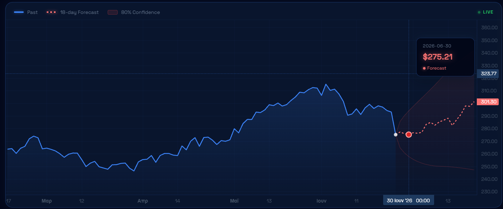
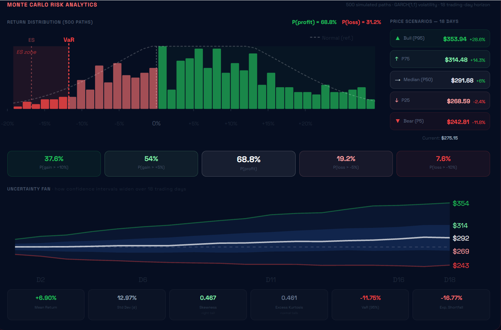
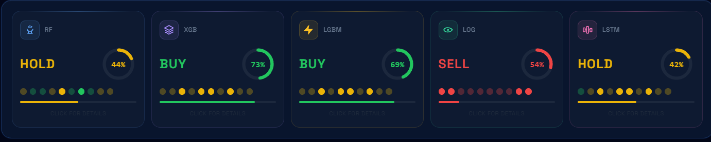
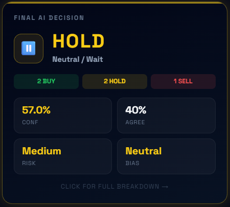
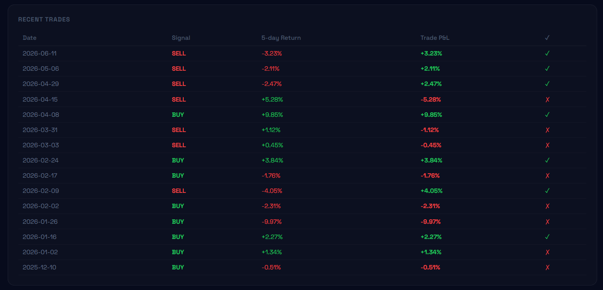
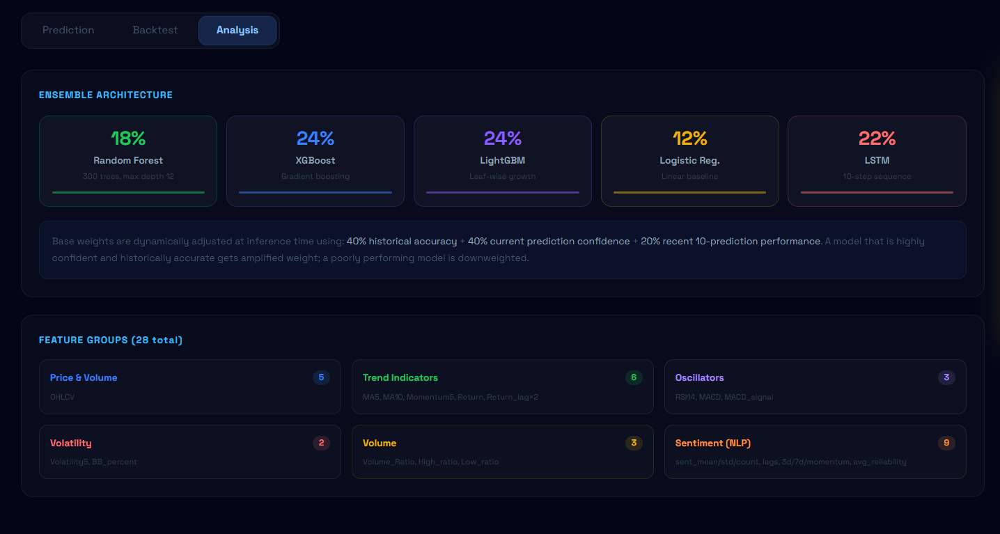
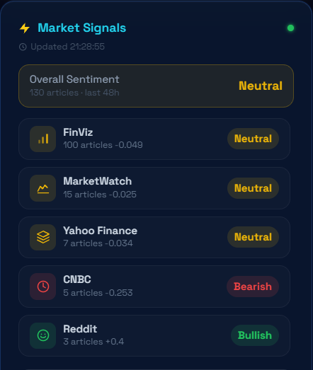
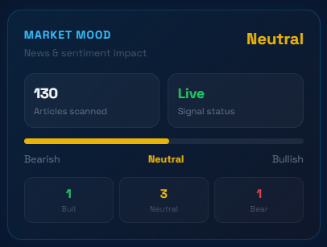
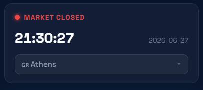

# Κεφάλαιο 5 — Ανάπτυξη εφαρμογής

Στο κεφάλαιο αυτό παρουσιάζεται η ανάπτυξη της λειτουργικής εφαρμογής, η οποία μετατρέπει τα εκπαιδευμένα μοντέλα σε ένα ολοκληρωμένο, διαδραστικό εργαλείο. Αναλύονται η αρχιτεκτονική πελάτη–εξυπηρετητή, το backend με τα τελικά του σημεία και τον μηχανισμό πρόβλεψης, η παραγωγή της προβολής τιμής και της ανάλυσης κινδύνου, και τέλος η διεπαφή χρήστη με τις επιμέρους οθόνες της.

## 5.1 Αρχιτεκτονική λογισμικού

Η εφαρμογή ακολουθεί μια αρχιτεκτονική διαχωρισμού **πελάτη–εξυπηρετητή** (client–server). Το **backend**, υλοποιημένο σε FastAPI, φορτώνει τα εκπαιδευμένα μοντέλα κατά την εκκίνηση και εκθέτει ένα σύνολο τελικών σημείων REST. Το **frontend**, υλοποιημένο σε React, επικοινωνεί με το backend μέσω αιτημάτων HTTP και αναλαμβάνει αποκλειστικά την παρουσίαση των αποτελεσμάτων.

Ο διαχωρισμός αυτός προσφέρει σημαντικά πλεονεκτήματα. Η υπολογιστικά απαιτητική λογική (φόρτωση μοντέλων, εξαγωγή προβλέψεων, προσομοιώσεις) εκτελείται στον εξυπηρετητή, ενώ ο πελάτης παραμένει ελαφρύς και αποκριτικός. Επιπλέον, τα δύο μέρη μπορούν να αναπτύσσονται και να συντηρούνται ανεξάρτητα. Η συνολική ροή δεδομένων του συστήματος αποτυπώθηκε στην Εικόνα 3.1.

## 5.2 Backend — Υπηρεσία FastAPI

### 5.2.1 Δομή και τελικά σημεία (API Endpoints)

Το backend εκθέτει έξι τελικά σημεία, καθένα από τα οποία εξυπηρετεί μια διακριτή λειτουργία, όπως συνοψίζεται στον Πίνακα 5.1.

**Πίνακας 5.1: Τα τελικά σημεία (endpoints) του backend.**

| Τελικό σημείο | Μέθοδος | Λειτουργία |
|---|---|---|
| `/predict/{ticker}` | GET | Πλήρης πρόβλεψη: ιστορικό, προβολή τιμής, ζώνες, ψήφοι μοντέλων, δείκτες κινδύνου |
| `/details/{ticker}` | GET | Αναλυτικά στοιχεία ανά μοντέλο και σύνθεση του ensemble |
| `/signals/{ticker}` | GET | Πρόσφατο συναίσθημα της αγοράς από τη βάση δεδομένων |
| `/backtest/{ticker}` | GET | Εκτέλεση ιστορικής προσομοίωσης (backtesting) |
| `/shap/{ticker}` | GET | Ανάλυση SHAP για την τρέχουσα πρόβλεψη |
| `/refresh/{ticker}` | POST | Εξαναγκασμός επανάληψης λήψης φρέσκων δεδομένων |

### 5.2.2 Ο μηχανισμός παραγωγής προβλέψεων

Όταν ληφθεί ένα αίτημα πρόβλεψης, το backend εκτελεί μια σειρά διαδοχικών βημάτων. Αρχικά ανακτά τα πιο πρόσφατα δεδομένα τιμών, υπολογίζει τα 28 χαρακτηριστικά και ενσωματώνει το τρέχον συναίσθημα. Στη συνέχεια, εφαρμόζει κάθε ένα από τα πέντε μοντέλα στην πιο πρόσφατη εγγραφή. Η τελική απόφαση προκύπτει με ψηφοφορία πλειοψηφίας, αφού πρώτα κάθε μοντέλο περάσει από το κατώφλι εμπιστοσύνης που περιγράφηκε στην ενότητα 4.6. Ο πυρήνας της λογικής αυτής φαίνεται στο ακόλουθο απόσπασμα:

```python
CONFIDENCE_THRESHOLD = 0.40  # πάνω από το 0.333 της τυχαίας πρόβλεψης

def predict_with_threshold(model, X_input):
    proba = model.predict_proba(X_input)[0]
    # επιστρέφει την πιο πιθανή κλάση μόνο αν υπάρχει επαρκής εμπιστοσύνη,
    # αλλιώς «Κράτηση» (κλάση 1)
    return int(np.argmax(proba)) if np.max(proba) >= CONFIDENCE_THRESHOLD else 1

votes = [rf_pred, xgb_pred, lgbm_pred, log_pred, lstm_pred]
final = max(set(votes), key=votes.count)   # ψηφοφορία πλειοψηφίας
```

Το αντίστοιχο τελικό σημείο που εκθέτει τη λειτουργία αυτή είναι ιδιαίτερα συνοπτικό, καθώς όλη η πολυπλοκότητα ενθυλακώνεται στη μηχανή πρόβλεψης:

```python
@app.get("/predict/{ticker}")
def predict(ticker: str):
    # επιστρέφει: ιστορικό, πρόβλεψη, ζώνες εμπιστοσύνης,
    # ψήφους μοντέλων, τελικό σήμα και δείκτες κινδύνου
    return predict_stock(ticker)
```

### 5.2.3 Προσωρινή αποθήκευση και ανίχνευση παλαιότητας

Για την αποφυγή περιττών —και χρονοβόρων— λήψεων δεδομένων, το backend διατηρεί μια προσωρινή μνήμη (cache) των δεδομένων τιμών, με χρονικό όριο ισχύος. Πριν από κάθε πρόβλεψη ελέγχεται, ωστόσο, αν τα δεδομένα είναι επίκαιρα: αν διαπιστωθεί ότι είναι παλαιότερα από την τελευταία ημέρα διαπραγμάτευσης, η μνήμη παρακάμπτεται και πραγματοποιείται νέα λήψη. Έτσι, συνδυάζεται η αποδοτικότητα με την εγκυρότητα των δεδομένων.

### 5.2.4 Δομή της μηχανής πρόβλεψης (predict_engine.py)

Ο πυρήνας της λογικής πρόβλεψης ενθυλακώνεται στο αρχείο `predict_engine.py`. Κατά την εκκίνηση του backend, φορτώνονται **μία φορά** όλα τα εκπαιδευμένα μοντέλα και οι αντίστοιχοι μετασχηματιστές κλιμάκωσης, ώστε κάθε επόμενο αίτημα να εξυπηρετείται άμεσα, χωρίς επαναφόρτωση:

```python
rf        = joblib.load(os.path.join(MODELS_DIR, "rf_final.pkl"))
xgb       = joblib.load(os.path.join(MODELS_DIR, "xgboost_final.pkl"))
lgbm      = joblib.load(os.path.join(MODELS_DIR, "lightgbm_final.pkl"))
log_model = joblib.load(os.path.join(MODELS_DIR, "logistic_final.pkl"))
lstm_cls_model  = load_model(os.path.join(MODELS_DIR, "lstm_final.keras"))
lstm_cls_scaler = joblib.load(os.path.join(MODELS_DIR, "lstm_scaler.pkl"))
```

Κρίσιμης σημασίας είναι η διατήρηση μιας **ενιαίας, κανονικής σειράς** των 28 χαρακτηριστικών, πανομοιότυπης με εκείνη που παρήγαγε το `merge_dataset.py`. Οι μετασχηματιστές των LSTM προσαρμόστηκαν σε αυτή ακριβώς τη σειρά· οποιαδήποτε αναδιάταξη θα προκαλούσε σιωπηλή λανθασμένη κλιμάκωση των εισόδων (το πρόβλημα αυτό αναλύεται στο Κεφάλαιο 7):

```python
# Η σειρά ΠΡΕΠΕΙ να ταυτίζεται με merge_dataset.py — αλλιώς οι στήλες
# κλιμακώνονται με λάθος παραμέτρους κατά την πρόβλεψη.
LSTM_FEATURES = ["Close", "High", "Low", "Open", "Volume",
                 "sent_mean", "sent_std", "sent_count", "avg_reliability",
                 "Return", "MA_5", "MA_10", "Volatility_5", ...]
```

Για την καμπύλη πρόβλεψης, το πολυβηματικό LSTM παράγει δέκα ημερήσιες αποδόσεις, οι οποίες **συνδυάζονται με την κατεύθυνση του ensemble** (60% ensemble / 40% LSTM) ώστε να αξιοποιείται η αξιοπιστία της ταξινόμησης· πέρα από τον ορίζοντα των δέκα ημερών, η πρόβλεψη αποσβένεται εκθετικά:

```python
direction = {0: -1, 1: 0, 2: 1}.get(int(ensemble_signal), 0)
blended = [(0.6 * direction + 0.4 * np.sign(r)) * abs(r) for r in pred_returns]
# απόσβεση για τις ημέρες πέρα από τις 10
extended = blended[-1] * np.exp(-0.1 * np.arange(steps - N_FORECAST_MS))
center   = last_price * np.cumprod(1 + np.concatenate([blended, extended]))
```

### 5.2.5 Οργάνωση του αρχείου backend (backend/main.py)

Το αρχείο `backend/main.py` αποτελεί το σημείο συνένωσης όλου του συστήματος: εκθέτει τα έξι τελικά σημεία (Πίνακας 5.1), καλεί τη μηχανή πρόβλεψης, συνθέτει το ensemble με δυναμική στάθμιση (ενότητα 4.7) και υπολογίζει την ανάλυση SHAP. Εκεί ορίζεται, επίσης, ο **χάρτης αξιοπιστίας των πηγών**, ο οποίος τροφοδοτεί τη σταθμισμένη συνάθροιση του συναισθήματος:

```python
SOURCES = {
    "cnbc":          {"label": "CNBC",          "reliability": 0.90},
    "benzinga":      {"label": "Benzinga",      "reliability": 0.85},
    "yahoo_finance": {"label": "Yahoo Finance", "reliability": 0.85},
    "marketwatch":   {"label": "MarketWatch",   "reliability": 0.80},
    "finviz":        {"label": "FinViz",        "reliability": 0.80},
    "reddit":        {"label": "Reddit",        "reliability": 0.60},
}
```

Η οργάνωση αυτή κρατά το backend λεπτό και ευανάγνωστο: η επιχειρησιακή λογική (μοντέλα, προβλέψεις, κίνδυνος) βρίσκεται στα εξειδικευμένα αρθρώματα (`predict_engine.py`, `backtest_engine.py`), ενώ το `main.py` περιορίζεται στη δρομολόγηση των αιτημάτων και στη σύνθεση των απαντήσεων.

## 5.3 Πρόβλεψη τιμής και ζώνες εμπιστοσύνης

### 5.3.1 Κεντρική γραμμή πρόβλεψης

Πέρα από το σήμα κατεύθυνσης, το σύστημα παράγει μια προβολή της μελλοντικής πορείας της τιμής για ορίζοντα δεκαοκτώ ημερών διαπραγμάτευσης. Η κεντρική γραμμή της προβολής βασίζεται στο πολυβηματικό δίκτυο LSTM (ενότητα 4.4), το οποίο προβλέπει τις επιμέρους ημερήσιες αποδόσεις, δίνοντας στην καμπύλη μια μορφή που αντανακλά μαθημένα πρότυπα και όχι τυχαίο θόρυβο.

### 5.3.2 Ζώνες εμπιστοσύνης

Γύρω από την κεντρική γραμμή υπολογίζονται **ζώνες εμπιστοσύνης**, οι οποίες αποτυπώνουν την αβεβαιότητα της πρόβλεψης. Για τον σκοπό αυτό, η μεταβλητότητα εκτιμάται με μοντέλο GARCH(1,1) (ενότητα 2.10.1), το οποίο αποτυπώνει τη μεταβαλλόμενη διακύμανση των αποδόσεων. Επιπλέον, το εύρος των ζωνών προσαρμόζεται δυναμικά ανάλογα με τον βαθμό **διαφωνίας** μεταξύ των μοντέλων: όταν τα μοντέλα συμφωνούν, οι ζώνες είναι στενότερες, ενώ όταν διαφωνούν, διευρύνονται, αποτυπώνοντας έντιμα τη μεγαλύτερη αβεβαιότητα. Η εκτίμηση της μεταβλητότητας με GARCH(1,1) υλοποιείται ως εξής:

```python
def _garch_vol_forecast(returns, steps):
    am  = arch_model(returns[-252:] * 100, vol="Garch", p=1, q=1)
    res = am.fit(disp="off")
    fc  = res.forecast(horizon=steps, reindex=False)
    vol = np.sqrt(fc.variance.values[-1]) / 100
    return np.clip(vol, 1e-4, 0.025)   # ανώτατη ημερήσια μεταβλητότητα 2.5%
```

Το γράφημα πρόβλεψης τιμής απεικονίζεται στην Εικόνα 5.1.


*Εικόνα 5.1: Γράφημα πρόβλεψης τιμής με 18ήμερη προβολή και ζώνες εμπιστοσύνης.*

## 5.4 Ανάλυση κινδύνου

### 5.4.1 Προσομοίωση Monte Carlo

Για την ολοκληρωμένη αποτύπωση του ρίσκου, το σύστημα εκτελεί προσομοίωση **Monte Carlo** με 500 διαδρομές (paths) για ορίζοντα δεκαοκτώ ημερών, αξιοποιώντας τη μεταβλητότητα του μοντέλου GARCH. Κάθε διαδρομή αποτελεί ένα πιθανό μελλοντικό σενάριο εξέλιξης της τιμής· από το σύνολό τους προκύπτει μια κατανομή πιθανών αποτελεσμάτων, η οποία επιτρέπει την ποσοτικοποίηση του κινδύνου. Ο πυρήνας της προσομοίωσης φαίνεται παρακάτω:

```python
# 500 διαδρομές με θόρυβο βασισμένο στη μεταβλητότητα GARCH
noise  = np.random.normal(0, 1, size=(500, steps))
prices = np.full(500, last_price)
for s in range(steps):
    step_noise = np.clip(noise[:, s] * garch_vol[s] * scale, -0.06, 0.06)
    prices     = prices * (1 + daily_ret[s] + step_noise)
    all_paths[:, s] = prices
```

### 5.4.2 Δείκτες κινδύνου

Από την κατανομή των προσομοιωμένων διαδρομών εξάγεται ένα πλήθος δεικτών κινδύνου, οι οποίοι παρουσιάζονται στον χρήστη:

- **Value at Risk (VaR 95%)** και **Expected Shortfall (ES 95%)**: η αναμενόμενη μέγιστη και η μέση ακραία ζημία σε επίπεδο εμπιστοσύνης 95%.
- **Μέγιστη πτώση (Max Drawdown)**: η μεγαλύτερη πτώση από κορυφή σε κοιλάδα.
- **Ιστόγραμμα κατανομής** των τελικών αποδόσεων και **πιθανότητες** (π.χ. πιθανότητα κέρδους).
- **Σενάρια τιμών** (αισιόδοξο, μέσο, απαισιόδοξο) και **διάγραμμα βεντάλιας (fan chart)** που δείχνει πώς διευρύνεται η αβεβαιότητα στον χρόνο.

Ο πίνακας ανάλυσης κινδύνου απεικονίζεται στην Εικόνα 5.2.


*Εικόνα 5.2: Πίνακας ανάλυσης κινδύνου με προσομοίωση Monte Carlo (κατανομή, VaR/ES, fan chart).*

## 5.5 Frontend — Διαδραστικό Dashboard

### 5.5.1 Δομή της διεπαφής

Η διεπαφή χρήστη οργανώνεται σε τρεις καρτέλες (tabs) — «Prediction», «Backtest» και «Analysis» — ενώ μια πλευρική στήλη (sidebar) παρουσιάζει μόνιμα το τελικό σήμα και τα ζωντανά σήματα της αγοράς. Η επικοινωνία με το backend γίνεται μέσω της βιβλιοθήκης axios· ενδεικτικά, η ανάκτηση μιας πρόβλεψης υλοποιείται ως εξής:

```javascript
const { data } = await axios.get(`${API}/predict/${ticker}`);
setPrediction(data);   // ενημέρωση της κατάστασης -> αυτόματη ανανέωση UI
```

### 5.5.2 Καρτέλα Πρόβλεψης (Prediction)

Η κύρια καρτέλα συγκεντρώνει τα βασικά αποτελέσματα: το γράφημα πρόβλεψης τιμής (ενότητα 5.3), τον πίνακα ανάλυσης κινδύνου (ενότητα 5.4) και τις κάρτες των πέντε μοντέλων, καθεμία από τις οποίες εμφανίζει το σήμα και την εμπιστοσύνη του αντίστοιχου μοντέλου. Στην πλευρική στήλη προβάλλεται η κάρτα της **τελικής απόφασης**, με το συνολικό σήμα, τον βαθμό συμφωνίας των μοντέλων (agreement) και την εκτίμηση κινδύνου.

Οι κάρτες των μοντέλων και η τελική απόφαση απεικονίζονται στην Εικόνα 5.3.



*Εικόνα 5.3: Κάρτες των πέντε μοντέλων και κάρτα τελικής απόφασης του ensemble.*

### 5.5.3 Καρτέλα Backtest

Η καρτέλα backtest παρουσιάζει τα αποτελέσματα της ιστορικής αξιολόγησης: την καμπύλη σωρευτικής απόδοσης σε σύγκριση με τη στρατηγική «αγορά και διακράτηση», την ακρίβεια ανά μοντέλο, έναν μηνιαίο χάρτη θερμότητας (heatmap) και τον πίνακα των συναλλαγών. Τα αποτελέσματα αυτά αναλύονται διεξοδικά στο Κεφάλαιο 6.

Η καρτέλα αποτελεσμάτων backtesting απεικονίζεται στην Εικόνα 5.4.


*Εικόνα 5.4: Καρτέλα αποτελεσμάτων backtesting: πρόσφατες συναλλαγές με σήμα, απόδοση και επιτυχία.*

### 5.5.4 Καρτέλα Ανάλυσης (Analysis)

Η καρτέλα ανάλυσης προσφέρει διαφάνεια ως προς τη λειτουργία του συστήματος. Περιλαμβάνει την ανάλυση SHAP των χαρακτηριστικών για την τρέχουσα πρόβλεψη, μια επισκόπηση της αρχιτεκτονικής του ensemble (με τα βάρη κάθε μοντέλου) και την ομαδοποίηση των 28 χαρακτηριστικών. Η καρτέλα αυτή ενσαρκώνει τη φιλοσοφία της ερμηνευσιμότητας που διέπει το σύστημα.

Η καρτέλα ανάλυσης και ερμηνευσιμότητας απεικονίζεται στην Εικόνα 5.5.


*Εικόνα 5.5: Καρτέλα ανάλυσης: αρχιτεκτονική του ensemble και ομάδες των 28 χαρακτηριστικών.*

### 5.5.5 Πλευρική στήλη — Ζωντανά σήματα αγοράς

Η πλευρική στήλη εμφανίζει τα πιο πρόσφατα σήματα συναισθήματος της αγοράς, αντλημένα από τη βάση δεδομένων, καθώς και έναν συνολικό δείκτη διάθεσης (market mood), αναλυμένο και ανά πηγή (FinViz, MarketWatch, Yahoo Finance, CNBC, Reddit). Το εμφανιζόμενο συναίσθημα δεν είναι απλός μέσος όρος, αλλά **σταθμισμένος ως προς την αξιοπιστία** κάθε πηγής (ενότητα 3.6), όπως υλοποιείται στη συνάρτηση συγκέντρωσης:

```python
def weighted_agg(group):
    w = group["reliability"].values        # βάρος αξιοπιστίας ανά πηγή
    s = group["sentiment"].values
    total_w = w.sum()
    w_mean = float(np.average(s, weights=w)) if total_w else 0.0   # σταθμισμένος μέσος
    return pd.Series({"sent_mean": w_mean, "sent_count": float(len(group))})
```

Με τον τρόπο αυτό, ο χρήστης έχει διαρκή εικόνα του κλίματος γύρω από τον επιλεγμένο δείκτη, χωρίς να χρειάζεται να αλλάξει καρτέλα.

Η πλευρική στήλη ζωντανών σημάτων απεικονίζεται στην Εικόνα 5.6.




*Εικόνα 5.6: Πλευρική στήλη: ζωντανά σήματα αγοράς ανά πηγή, δείκτης διάθεσης και κατάσταση αγοράς.*

## 5.6 Συμπεράσματα

Η εφαρμογή που αναπτύχθηκε μεταφράζει τα εκπαιδευμένα μοντέλα σε ένα ολοκληρωμένο, διαδραστικό εργαλείο. Η αρχιτεκτονική πελάτη–εξυπηρετητή διαχωρίζει καθαρά την υπολογιστική λογική από την παρουσίαση, ενώ το backend FastAPI προσφέρει ένα ευέλικτο σύνολο τελικών σημείων. Η διεπαφή React παρουσιάζει όχι μόνο την τελική πρόβλεψη, αλλά και την προβολή τιμής, την ανάλυση κινδύνου, τα αποτελέσματα backtesting και την ερμηνεία των προβλέψεων, προσφέροντας στον χρήστη μια διαφανή και ολοκληρωμένη εμπειρία. Η πρακτική αποτελεσματικότητα της στρατηγικής που υλοποιεί το σύστημα αξιολογείται στο Κεφάλαιο 6.
