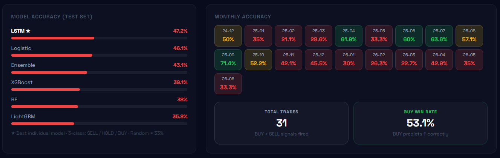
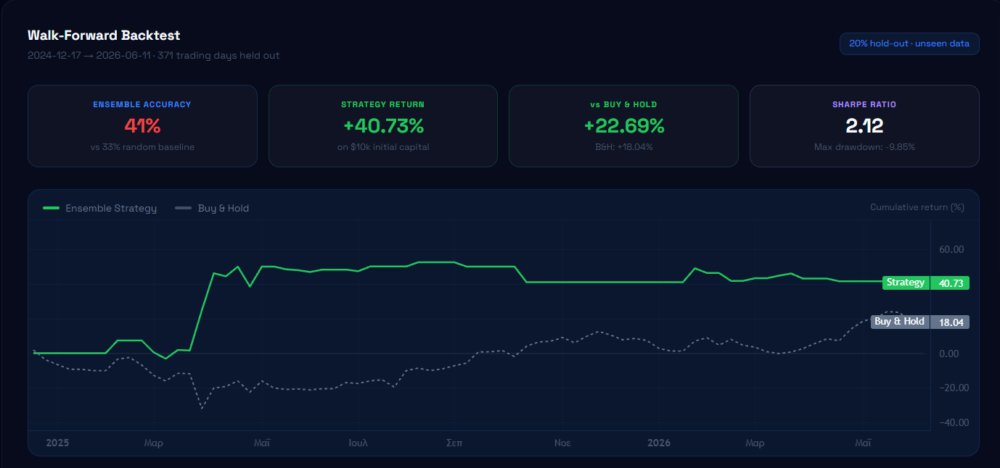

# Κεφάλαιο 6 — Αξιολόγηση συστήματος

Στο κεφάλαιο αυτό αξιολογείται η πρακτική αποτελεσματικότητα του συστήματος μέσω ιστορικής προσομοίωσης (backtesting) της επενδυτικής στρατηγικής που υλοποιεί. Παρουσιάζονται η μεθοδολογία αξιολόγησης, τα αναλυτικά αποτελέσματα και για τους δώδεκα δείκτες και, με έμφαση στην επιστημονική εντιμότητα, μια κριτική ερμηνεία τους που αποφεύγει τόσο την υπερβολική αισιοδοξία όσο και την υποτίμηση των ευρημάτων.

## 6.1 Μεθοδολογία backtesting

Η αξιολόγηση πραγματοποιήθηκε με τη μέθοδο της προελαύνουσας επικύρωσης (walk-forward), αποκλειστικά στο **σύνολο ελέγχου** — δηλαδή στο τελευταίο 20% των δεδομένων κάθε δείκτη, το οποίο δεν χρησιμοποιήθηκε ποτέ κατά την εκπαίδευση. Η περίοδος ελέγχου καλύπτει, χονδρικά, το διάστημα από τον Δεκέμβριο 2024 έως τον Ιούνιο 2026.

Η στρατηγική που προσομοιώνεται είναι απλή και διαφανής: για κάθε σήμα «Αγορά» λαμβάνεται θέση αγοράς (long) για τις επόμενες πέντε ημέρες· για κάθε σήμα «Πώληση» λαμβάνεται θέση πώλησης (short)· ενώ για κάθε σήμα «Κράτηση» η θέση παραμένει σε μετρητά, με μηδενική απόδοση. Για την αποφυγή αλληλεπικάλυψης, χρησιμοποιούνται **μη επικαλυπτόμενα παράθυρα πέντε ημερών**. Η απόδοση της στρατηγικής συγκρίνεται με τη στρατηγική αναφοράς «αγορά και διακράτηση» (buy & hold), ενώ υπολογίζονται και δείκτες προσαρμοσμένοι ως προς τον κίνδυνο, όπως ο λόγος Sharpe (απόδοση ανά μονάδα κινδύνου) και η μέγιστη πτώση (max drawdown). Ο πυρήνας της προσομοίωσης, με μη επικαλυπτόμενα παράθυρα και αρχικό κεφάλαιο 10.000$, φαίνεται παρακάτω:

```python
# μη επικαλυπτόμενα παράθυρα 5 ημερών
window_idx = list(range(0, len(test_df), 5))
strat_eq, bh_eq = [10_000.0], [10_000.0]
for sig, ret in zip(w_signals, w_returns):
    # Αγορά(2) -> long, Πώληση(0) -> short, Κράτηση(1) -> μετρητά
    pnl = ret if sig == 2 else (-ret if sig == 0 else 0.0)
    strat_eq.append(strat_eq[-1] * (1 + pnl))   # καμπύλη στρατηγικής
    bh_eq.append(bh_eq[-1]       * (1 + ret))    # καμπύλη αγοράς & διακράτησης
```

**Παραδοχές και περιορισμοί της προσομοίωσης.** Για την ορθή ερμηνεία των αποτελεσμάτων, οι παραδοχές του backtesting δηλώνονται ρητώς:

- **Μετατροπή σήματος σε θέση:** σήμα «Αγορά» → θέση αγοράς (long), «Πώληση» → θέση πώλησης (short), «Κράτηση» → παραμονή σε μετρητά (μηδενική απόδοση). Κάθε θέση διατηρείται για πέντε ημέρες, σε **μη επικαλυπτόμενα παράθυρα**, ώστε να αποφεύγεται η αυτοσυσχέτιση στα αποτελέσματα.
- **Χρόνος εκτέλεσης:** το σήμα παράγεται με βάση τα δεδομένα κλεισίματος μιας ημέρας και η θέση αποτιμάται στην απόδοση των επόμενων ημερών· δεν υπεισέρχεται μελλοντική πληροφορία.
- **Αποφυγή look-ahead bias:** όλα τα χαρακτηριστικά υπολογίζονται αποκλειστικά από παρελθόντα δεδομένα, ο διαχωρισμός είναι χρονικός ανά δείκτη (`is_train`) και οι μετασχηματιστές κλιμάκωσης προσαρμόζονται μόνο στα δεδομένα εκπαίδευσης (βλ. Κεφάλαιο 7).

Αναγνωρίζονται, ωστόσο, και σαφείς **περιορισμοί**, οι οποίοι σημειώνονται με επιστημονική εντιμότητα:

- **Κόστη συναλλαγών και slippage:** η προσομοίωση **δεν** ενσωματώνει προμήθειες, spread αγοράς–πώλησης ή ολίσθηση τιμής (slippage). Σε ένα πραγματικό χαρτοφυλάκιο με συχνές εναλλαγές θέσεων, τα κόστη αυτά θα μείωναν την καθαρή απόδοση.
- **Survivorship bias:** χρησιμοποιήθηκε σταθερό σύμπαν δώδεκα μεγάλων δεικτών που υφίστανται σήμερα· δεν περιλαμβάνονται μετοχές που διαγράφηκαν, στοιχείο που μπορεί να εισάγει μεροληψία επιβίωσης.
- **Ρευστότητα και μέγεθος θέσης:** θεωρείται ότι κάθε θέση εκτελείται πλήρως στην τιμή κλεισίματος, χωρίς επίδραση στην αγορά (market impact) και χωρίς περιορισμούς ρευστότητας.
- **Απλοϊκή στρατηγική short:** η ανοικτή πώληση (short) θεωρείται πάντοτε διαθέσιμη και χωρίς κόστος δανεισμού.

Τα αποτελέσματα που ακολουθούν πρέπει, συνεπώς, να ερμηνεύονται ως **ενδεικτικά της προγνωστικής ικανότητας** των μοντέλων υπό εξιδανικευμένες συνθήκες, και όχι ως εγγύηση πραγματικής χρηματιστηριακής απόδοσης.

## 6.2 Συνολικά αποτελέσματα ανά δείκτη

Ο Πίνακας 6.1 συνοψίζει τα αποτελέσματα και για τους δώδεκα δείκτες. Παρατηρείται **έντονη διακύμανση** ανά δείκτη, τόσο στην ακρίβεια του ensemble όσο και στην απόδοση της στρατηγικής.

**Πίνακας 6.1: Αναλυτικά αποτελέσματα backtesting ανά δείκτη (σύνολο ελέγχου, Δεκ. 2024 – Ιούν. 2026).**

| Δείκτης | Ακρίβεια ensemble | Απόδοση στρατηγικής | Αγορά & Διακράτηση | Sharpe | Μέγ. πτώση |
|---|---|---|---|---|---|
| AAPL | 41.0% | +40.7% | +18.0% | 2.12 | -9.9% |
| MSFT | 43.1% | +3.8% | -15.9% | 0.51 | -14.5% |
| AMZN | 37.2% | -24.2% | +5.3% | -1.19 | -30.9% |
| GOOGL | 33.4% | -29.6% | +89.2% | -1.72 | -36.2% |
| TSLA | 36.9% | -29.2% | -17.3% | -0.25 | -48.5% |
| NVDA | 36.9% | -32.7% | +61.4% | -1.09 | -37.6% |
| META | 36.7% | +43.1% | -6.9% | 2.29 | -18.5% |
| NFLX | 32.3% | +44.1% | -16.1% | 1.94 | -16.7% |
| AMD | 41.0% | +131.7% | +325.6% | 2.72 | -35.4% |
| INTC | 36.1% | -87.2% | +553.4% | -2.95 | -90.6% |
| SPY | 70.9% | +3.2% | +25.8% | 0.53 | -11.5% |
| QQQ | 56.1% | -5.9% | +39.2% | -0.40 | -14.7% |

## 6.3 Ανάλυση της ακρίβειας ταξινόμησης

Η ακρίβεια του ensemble παρουσιάζει ενδιαφέρουσα διακύμανση. Στις μεμονωμένες μετοχές κυμαίνεται μεταξύ 32% και 43%, σε συμφωνία με τα αποτελέσματα του Κεφαλαίου 4. Αξιοσημείωτα υψηλότερη, ωστόσο, είναι η ακρίβεια στα δύο διαπραγματεύσιμα αμοιβαία κεφάλαια δεικτών: SPY 70.9% και QQQ 56.1%. Η εξήγηση είναι διαφωτιστική: τα ETF, ως διαφοροποιημένα καλάθια μετοχών, παρουσιάζουν χαμηλότερη μεταβλητότητα από τις μεμονωμένες μετοχές, με αποτέλεσμα οι ημερήσιες κινήσεις τους να ξεπερνούν σπανιότερα το κατώφλι του ±2%. Έτσι, η κατηγορία «Κράτηση» κυριαρχεί, και το σύστημα —που τείνει συντηρητικά προς αυτήν— πετυχαίνει υψηλότερη ακρίβεια. Το φαινόμενο αυτό υπενθυμίζει ότι η ακρίβεια ταξινόμησης από μόνη της δεν επαρκεί ως μέτρο αξίας, καθώς υψηλή ακρίβεια μπορεί να συνοδεύεται από χαμηλή χρησιμότητα (όπως δείχνει η μέτρια απόδοση της στρατηγικής στα ETF).

## 6.4 Ακρίβεια ανά μοντέλο και στατιστική σημαντικότητα

Πέρα από το ensemble, ο Πίνακας 6.2 παρουσιάζει τη μέση ακρίβεια κάθε επιμέρους μοντέλου στο backtest, ως μέσο όρο και των δώδεκα δεικτών. Όλα τα μοντέλα κινούνται σε παρόμοια επίπεδα, με το LSTM να υπερτερεί οριακά.

**Πίνακας 6.2: Μέση ακρίβεια ανά μοντέλο στο backtest (μέσος όρος 12 δεικτών).**

| Μοντέλο | Μέση ακρίβεια | Εύρος |
|---|---|---|
| Random Forest | 40.6% | 30.2 – 68.7% |
| XGBoost | 40.6% | 30.7 – 67.4% |
| LightGBM | 40.5% | 33.4 – 66.3% |
| Logistic Regression | 41.5% | 34.0 – 69.8% |
| LSTM | 42.0% | 33.2 – 71.2% |
| **Ensemble** | **41.8%** | 32.3 – 70.9% |

Το ευρύ φάσμα τιμών (π.χ. 32% έως 71%) αντανακλά τη διαφορά μεταξύ των μεμονωμένων μετοχών και των λιγότερο μεταβλητών ETF, όπως αναλύθηκε στην ενότητα 6.3.

Για **αυστηρή στατιστική τεκμηρίωση**, εξετάζουμε τη συνολική (pooled) επίδοση ταξινόμησης στο **ενιαίο σύνολο ελέγχου των 4.452 παρατηρήσεων** (το τελευταίο 20% κάθε δείκτη, χρονικά). Ο Πίνακας 6.3 παρουσιάζει, για κάθε μοντέλο, την ακρίβεια με **95% διάστημα εμπιστοσύνης** (μέθοδος Wilson), καθώς και τις μετρικές **macro-F1** και **ισορροπημένης ακρίβειας** (balanced accuracy) — οι οποίες, σε αντίθεση με τη σκέτη ακρίβεια, δεν ευνοούν την πλειοψηφική κλάση.

**Πίνακας 6.3: Συνολικές μετρικές ταξινόμησης στο σύνολο ελέγχου (n = 4.452).**

| Μοντέλο | Ακρίβεια | 95% Δ.Ε. (Wilson) | macro-F1 | Balanced acc. |
|---|---|---|---|---|
| Random Forest | 40.6% | [39.2%, 42.1%] | 0.400 | 39.9% |
| XGBoost | 40.6% | [39.1%, 42.0%] | 0.400 | 40.1% |
| LightGBM | 40.5% | [39.1%, 41.9%] | 0.402 | 40.2% |
| **Logistic Regression** | **41.6%** | **[40.1%, 43.0%]** | 0.400 | 40.7% |

Σημειώνεται ότι ο Πίνακας 6.3 αφορά τα τέσσερα μη ακολουθιακά (tabular) μοντέλα, για τα οποία υπολογίζεται απευθείας η συγκεντρωτική επίδοση· το νευρωνικό δίκτυο LSTM, ως ακολουθιακό μοντέλο, αξιολογείται χωριστά και πετυχαίνει την υψηλότερη ακρίβεια (41.7%, Πίνακας 4.1). Μεταξύ των tabular μοντέλων, ισχυρότερο είναι η Logistic Regression.

Είναι σημαντικό ότι η macro-F1 (~0.40) και η balanced accuracy (~40%) παραμένουν συγκρίσιμες με την ακρίβεια· αυτό δείχνει ότι τα μοντέλα **δεν στηρίζονται απλώς στην πρόβλεψη της πλειοψηφικής κλάσης**, αλλά διατηρούν ισορροπημένη επίδοση και στις τρεις κατηγορίες.

**Στατιστική σημαντικότητα.** Η διαφορά του καλύτερου μοντέλου (Logistic, 41.6%) από τη βασική γραμμή πλειοψηφίας (37.9%) είναι 3.7 ποσοστιαίες μονάδες — μετρημένη, αλλά στατιστικά σημαντική. Για τη στατιστική τεκμηρίωση χρησιμοποιούνται **δύο διακριτοί έλεγχοι**, καθένας κατάλληλος για διαφορετική σύγκριση:

- *Υπεροχή έναντι της τύχης.* Εφαρμόζεται **μονόπλευρος διωνυμικός έλεγχος** (binomial test), ο οποίος ελέγχει αν η παρατηρούμενη ακρίβεια υπερβαίνει μια **σταθερή πιθανότητα επιτυχίας αναφοράς**. Έναντι του τυχαίου ορίου (p₀ = 1/3) προκύπτει **p ≈ 1.6×10⁻³⁰** στις 4.452 παρατηρήσεις. (Σημειώνεται ότι ο διωνυμικός έλεγχος είναι κατάλληλος ακριβώς για σύγκριση με σταθερή πιθανότητα και όχι για σύγκριση δύο μοντέλων.)

- *Υπεροχή έναντι του ταξινομητή πλειοψηφίας.* Επειδή ο ταξινομητής πλειοψηφίας (που προβλέπει πάντα «Κράτηση») αξιολογείται στις **ίδιες ακριβώς παρατηρήσεις**, η σύγκριση είναι **συζευγμένη** και ο κατάλληλος έλεγχος είναι ο **McNemar**. Από τα discordant ζεύγη (877 περιπτώσεις όπου το μοντέλο είναι σωστό ενώ η πλειοψηφία λάθος, έναντι 716 του αντιστρόφου) προκύπτει **χ² = 16.07** (με διόρθωση συνέχειας), δηλαδή **p ≈ 6.1×10⁻⁵**.

Επιπλέον, καθοριστικό είναι ότι το **κάτω όριο του 95% διαστήματος εμπιστοσύνης της ακρίβειας (40.1%) βρίσκεται πάνω από τη γραμμή πλειοψηφίας (37.9%)**. Και οι δύο έλεγχοι, μαζί με το διάστημα εμπιστοσύνης, συγκλίνουν στο ότι η υπεροχή του μοντέλου **δεν είναι στατιστικό τυχαίο**, παρά το μέτριο απόλυτο μέγεθός της.

Τέλος, ο Πίνακας 6.4 αναλύει την επίδοση του ισχυρότερου μοντέλου (Logistic Regression) **ανά κλάση**, ώστε να μην αποκρύπτεται η ανομοιογένεια πίσω από τη συνολική ακρίβεια.

**Πίνακας 6.4: Αναλυτική επίδοση ανά κλάση (Logistic Regression, σύνολο ελέγχου).**

| Κλάση | Precision | Recall | F1 | Πλήθος |
|---|---|---|---|---|
| Πώληση | 0.31 | 0.39 | 0.34 | 1.261 |
| Κράτηση | 0.51 | 0.58 | 0.54 | 1.689 |
| Αγορά | 0.40 | 0.26 | 0.31 | 1.502 |

Η κατηγορία «Κράτηση» προβλέπεται καλύτερα (F1 0.54), ενώ οι εντονότερες κινήσεις «Αγορά»/«Πώληση» είναι δυσκολότερες — εύρημα απολύτως συμβατό με τη φύση του προβλήματος και με τα αντίστοιχα αποτελέσματα του XGBoost (Πίνακας 4.2).

## 6.5 Μηνιαία διακύμανση της απόδοσης

Η ακρίβεια του συστήματος δεν είναι σταθερή στον χρόνο, αλλά μεταβάλλεται ανάλογα με τις συνθήκες της αγοράς. Ο Πίνακας 6.5 παρουσιάζει, ενδεικτικά, τη μηνιαία ακρίβεια του ensemble για τον δείκτη AAPL κατά την περίοδο ελέγχου.

**Πίνακας 6.5: Μηνιαία ακρίβεια του ensemble για τον δείκτη AAPL.**

| Μήνας | Ακρίβεια | Μήνας | Ακρίβεια |
|---|---|---|---|
| 2024-12 | 30.0% | 2025-06 | 20.0% |
| 2025-01 | 45.0% | 2025-07 | 59.1% |
| 2025-02 | 57.9% | 2025-08 | 28.6% |
| 2025-03 | 47.6% | 2025-09 | 33.3% |
| 2025-04 | 66.7% | 2025-10 | 34.8% |
| 2025-05 | 38.1% | 2025-11 | 47.4% |

Παρατηρείται έντονη διακύμανση, από 20% έως 66.7%. Η μεταβλητότητα αυτή είναι αναμενόμενη: σε περιόδους με σαφή τάση το σύστημα αποδίδει καλύτερα, ενώ σε περιόδους έντονης αναταραχής ή απότομων αντιστροφών η ακρίβεια πέφτει. Το εύρημα αυτό υπογραμμίζει ότι η μέση ακρίβεια κρύβει σημαντική χρονική ανομοιογένεια, την οποία ένας πραγματικός χρήστης οφείλει να λαμβάνει υπόψη.

Τα αποτελέσματα της ακρίβειας ανά μοντέλο και της μηνιαίας διακύμανσης προβάλλονται και στη διεπαφή του συστήματος, όπως φαίνεται στην Εικόνα 6.1.


*Εικόνα 6.1: Ακρίβεια ανά μοντέλο (test set) και μηνιαία διακύμανση της απόδοσης στη διεπαφή.*

## 6.6 Ανάλυση της απόδοσης της στρατηγικής

Η εικόνα της απόδοσης είναι σαφώς **διαφοροποιημένη**. Η στρατηγική του συστήματος υπερέβη την απλή «αγορά και διακράτηση» σε **τέσσερις από τους δώδεκα** δείκτες (AAPL, MSFT, META, NFLX), ενώ σημείωσε θετική απόδοση σε **έξι από τους δώδεκα**. Ιδιαίτερα ενθαρρυντικά είναι τα αποτελέσματα στους δείκτες AAPL, META και NFLX, όπου η στρατηγική πέτυχε υψηλές αποδόσεις με ισχυρό λόγο Sharpe (έως 2.29), αλλά και η περίπτωση της MSFT, όπου **προστάτευσε το κεφάλαιο** σημειώνοντας θετική απόδοση τη στιγμή που η αγορά & διακράτηση κατέγραφε ζημία.

Από την άλλη πλευρά, σε δείκτες με ισχυρή ανοδική πορεία κατά την περίοδο ελέγχου (GOOGL +89%, NVDA +61%, AMD +326%, INTC +553%) η στρατηγική υστέρησε σημαντικά. Η ακραία περίπτωση είναι η INTC: η σημαντική και παρατεταμένη άνοδος της μετοχής, σε συνδυασμό με τα λανθασμένα σήματα πώλησης (short), οδήγησε σε ζημία -87%. Το παράδειγμα αυτό αναδεικνύει με σαφήνεια τον **κίνδυνο της απλοϊκής στρατηγικής short**: η λήψη θέσης πώλησης σε μια ανοδική αγορά μπορεί να αποφέρει καταστροφικές απώλειες.

Λόγω αυτών των ακραίων τιμών (ιδίως AMD και INTC), ο απλός μέσος όρος των αποδόσεων είναι παραπλανητικός. Πιο αντιπροσωπευτική είναι η **διάμεσος** (median): η διάμεση απόδοση της στρατηγικής ήταν περίπου -1%, έναντι διάμεσης απόδοσης +22% για την αγορά & διακράτηση. Συνεπώς, στο σύνολο της περιόδου, η στρατηγική **δεν υπερέβη συστηματικά** την αγορά.

## 6.7 Ερμηνεία και κριτική συζήτηση

Τα αποτελέσματα οδηγούν σε μια **έντιμη και νηφάλια** αποτίμηση. Είναι σαφές ότι η στρατηγική του συστήματος, στη συγκεκριμένη μορφή της και για τη συγκεκριμένη περίοδο, δεν κατάφερε να υπερβεί συστηματικά την αγορά. Η διαπίστωση αυτή, ωστόσο, δεν αποτελεί αδυναμία της εργασίας, αλλά **ρεαλιστικό και αναμενόμενο εύρημα**, για τους εξής λόγους:

Πρώτον, είναι απολύτως σύμφωνη με την υπόθεση της αποτελεσματικής αγοράς (Fama, 1970): η συστηματική υπερκέραση της αγοράς είναι, θεωρητικά και πρακτικά, εξαιρετικά δύσκολη. Δεύτερον, η περίοδος ελέγχου υπήρξε σε μεγάλο βαθμό ισχυρά ανοδική, ιδίως για τον τεχνολογικό κλάδο — ένα περιβάλλον στο οποίο κάθε συντηρητική ή πτωτική στρατηγική υστερεί έναντι της απλής διακράτησης. Τρίτον, η απλοϊκή στρατηγική long/short που υιοθετήθηκε για λόγους διαφάνειας τιμωρείται δυσανάλογα στις ανοδικές αγορές.

Η αξία του συστήματος, επομένως, δεν έγκειται στην υπόσχεση εγγυημένων υπερβαλλουσών αποδόσεων — κάτι που θα ήταν επιστημονικά αμφισβητήσιμο και ηθικά προβληματικό. Έγκειται (α) στην **τεκμηριωμένη συνεισφορά της ανάλυσης συναισθήματος** (Κεφάλαιο 4), (β) στην **ικανότητα προστασίας έναντι του κινδύνου** που επέδειξε σε αρκετούς δείκτες (AAPL, META, NFLX, MSFT, με υψηλούς λόγους Sharpe), και (γ) στη **μεθοδολογικά ορθή και διαφανή** προσέγγιση, η οποία επιτρέπει την αξιόπιστη αποτίμηση των δυνατοτήτων και των ορίων του.

Η καμπύλη σωρευτικής απόδοσης απεικονίζεται στην Εικόνα 6.2.


*Εικόνα 6.2: Καμπύλη σωρευτικής απόδοσης στρατηγικής έναντι αγοράς & διακράτησης (walk-forward).*

## 6.8 Μελέτη σχημάτων στάθμισης συναισθήματος

Η ανάλυση συναισθήματος αποτελεί καθιερωμένο πεδίο της επεξεργασίας φυσικής γλώσσας (Pang & Lee, 2008), και η αξιοποίησή της από διαδικτυακές πηγές για την πρόβλεψη της αγοράς έχει μελετηθεί εκτενώς (Antweiler & Frank, 2004· Oliveira et al., 2017). Παράλληλα, η **αξιοπιστία της πηγής** αναγνωρίζεται ως κρίσιμος παράγοντας για την ποιότητα της πληροφορίας (Castillo et al., 2011). Στο πλαίσιο αυτό, διερευνάται εδώ ένα εστιασμένο ερευνητικό ερώτημα: *βελτιώνει η στάθμιση του συναισθήματος με βάση την αξιοπιστία της πηγής την πρόβλεψη, σε σχέση με την απλή (μη σταθμισμένη) συνάθροιση και με βάρη που μαθαίνονται από τα δεδομένα;*

Για την απάντηση, εκπαιδεύτηκε το ίδιο μοντέλο (XGBoost, ίδιες υπερπαράμετροι, ίδιος per-ticker χρονικός διαχωρισμός) με τέσσερις διαφορετικές αναπαραστάσεις του συναισθήματος, στο υποσύνολο 2024+ όπου υπάρχουν πραγματικά δεδομένα συναισθήματος (n_test = 1.476):

- **price-only:** χωρίς κανένα χαρακτηριστικό συναισθήματος.
- **unweighted:** απλός, μη σταθμισμένος μέσος όρος του συναισθήματος όλων των πηγών.
- **reliability-weighted:** στάθμιση με τα βάρη αξιοπιστίας ανά πηγή (η προτεινόμενη μέθοδος).
- **learned:** βάρη ανά πηγή που μαθαίνονται από τη συσχέτιση του συναισθήματος με τη μελλοντική απόδοση, αποκλειστικά στο σύνολο εκπαίδευσης.

Τα αποτελέσματα της σύγκρισης συνοψίζονται στον Πίνακα 6.6.

**Πίνακας 6.6: Σύγκριση σχημάτων στάθμισης συναισθήματος (XGBoost, υποσύνολο 2024+, n_test = 1.476).**

| Σχήμα στάθμισης | Ακρίβεια | macro-F1 | Balanced acc. |
|---|---|---|---|
| price-only (χωρίς συναίσθημα) | 37,74% | 0,367 | 36,87% |
| Μη σταθμισμένο (unweighted) | 38,89% | 0,370 | 37,76% |
| **Σταθμισμένο ως προς αξιοπιστία** | **39,16%** | **0,371** | 37,95% |
| Learned weights | 39,16% | 0,370 | 37,88% |

**Ευρήματα.** Με επιστημονική εντιμότητα, προκύπτουν τρία συμπεράσματα:

1. Η προσθήκη συναισθήματος **βελτιώνει σαφώς** την πρόβλεψη: **+1,4 ποσοστιαίες μονάδες** έναντι του price-only (37,74% → 39,16%), επιβεβαιώνοντας ανεξάρτητα τη μελέτη απομόνωσης της ενότητας 4.8.
2. Η **στάθμιση αξιοπιστίας υπερέχει** της μη σταθμισμένης συνάθροισης, αλλά **οριακά**: +0,27 μονάδες ακρίβειας και +0,001 macro-F1. Η κατεύθυνση είναι συνεπής (η αξιοπιστία βοηθά), αλλά το μέγεθος είναι μικρό — εντός του εύρους στατιστικού θορύβου. Δεν θα ήταν, επομένως, έντιμο να παρουσιαστεί ως ισχυρή βελτίωση.
3. Το σχήμα **learned weights δεν μπορεί να αξιολογηθεί αξιόπιστα** με τα παρόντα δεδομένα: επειδή οι ζωντανές πηγές (CNBC, FinViz, Reddit κ.λπ.) διαθέτουν δεδομένα κυρίως στην πιο πρόσφατη περίοδο —η οποία εμπίπτει στο σύνολο ελέγχου— το σύνολο εκπαίδευσης καλύπτεται σχεδόν αποκλειστικά από μία ιστορική πηγή, με αποτέλεσμα τα μαθημένα βάρη να εκφυλίζονται. Η αξιόπιστη μάθηση βαρών ανά πηγή απαιτεί μεγαλύτερη χρονική κάλυψη όλων των πηγών και αποτελεί σαφή κατεύθυνση μελλοντικής έρευνας.

Συνολικά, η ανάλυση επιβεβαιώνει την αξία του συναισθήματος και τη (μικρή) θετική συνεισφορά της στάθμισης αξιοπιστίας, ενώ αναδεικνύει με διαφάνεια τα όρια που θέτει η διαθεσιμότητα δεδομένων στη διερεύνηση πιο σύνθετων, προσαρμοστικών σχημάτων στάθμισης.

## 6.9 Συμπεράσματα

Η αξιολόγηση κατέδειξε ότι το σύστημα διαθέτει μετρήσιμη προγνωστική ικανότητα (ακρίβεια άνω των ορίων αναφοράς), η οποία όμως δεν μεταφράζεται σε συστηματική υπερκέραση της αγοράς σε κάθε δείκτη. Η στρατηγική αποδίδει καλύτερα σε ορισμένους δείκτες και προσφέρει προστασία έναντι του κινδύνου, ενώ υστερεί σημαντικά σε ισχυρά ανοδικές περιόδους, ιδίως λόγω της απλοϊκής στρατηγικής short. Η έντιμη αυτή αποτίμηση, που στηρίζεται σε αυστηρό χρονικό διαχωρισμό και στην παρουσίαση και των δώδεκα δεικτών χωρίς επιλεκτική προβολή, προσδίδει αξιοπιστία στα συμπεράσματα και αποτελεί, αυτή καθαυτή, μία από τις σημαντικότερες συνεισφορές της εργασίας.
